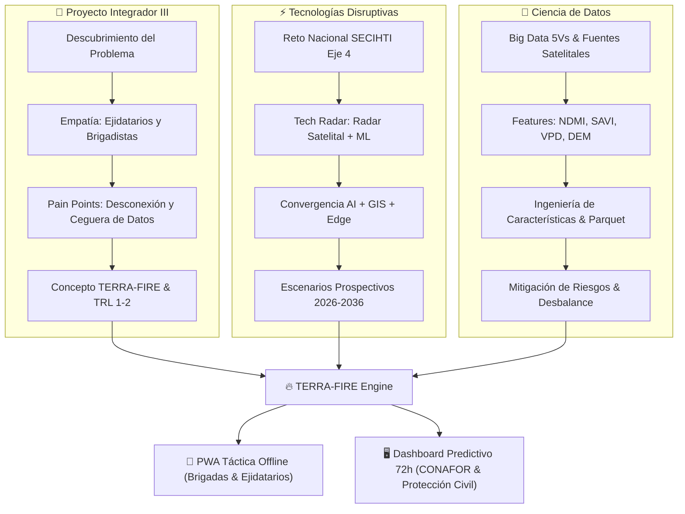
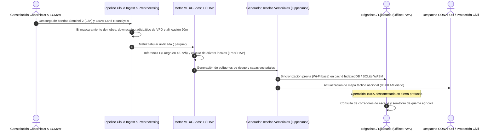
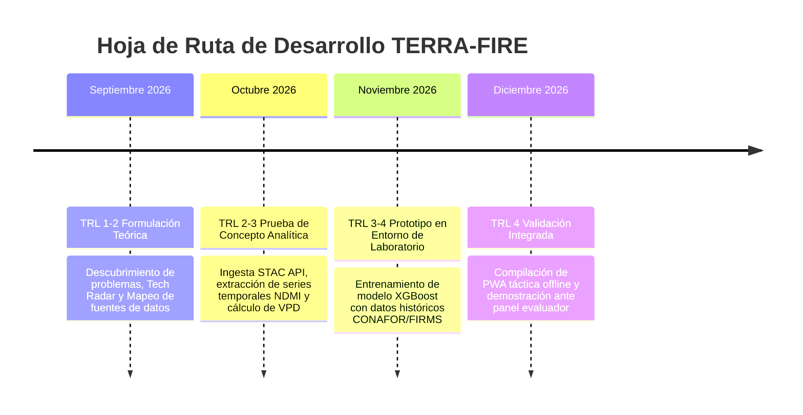

# 🛰️ TERRA-FIRE: Panel Central de Control & Mapa de Contenido (MOC)

> [!tip] Navegación Rápida
> Este panel es el centro neurálgico de la bóveda. Conecta los 3 pilares académicos del cuatrimestre Sep-Dic 2026 con la especificación técnica de la plataforma **TERRA-FIRE**. También puedes abrir [[TERRA-FIRE Visual Overview.canvas|el Lienzo Visual Canvas]] para una experiencia en 2D.

---

## 📌 Métricas y Parámetros Operativos Clave

| Métrica / Parámetro | Valor Objetivo | Justificación Técnica |
| :--- | :--- | :--- |
| **Nivel de Madurez Tecnológica** | **TRL 2** | Concepto formulado y validado analíticamente contra literatura científica. |
| **Ventana de Anticipación (Lead Time)** | **48 a 72 Horas** | Tiempo necesario para movilización preventiva de brigadas y moratorias de quema. |
| **Resolución Espacial** | **10 a 20 Metros** | Vóxeles basados en Copernicus Sentinel-2 MSI para capturar micro-cañadas y laderas. |
| **Cadencia Temporal** | **Diaria / 5 Días** | Reanálisis horario ERA5-Land (downscaling) + reflectancia orbital Sentinel cada 5 días. |
| **Conectividad en Campo** | **0% (100% Offline)** | PWA con almacenamiento local SQLite/WASM y teselas vectoriales Mapbox (.pbf). |
| **Causa Raíz Atendida** | **>80% Incendios** | Quemas agropecuarias (roza y quema) que escapan de control por cambio microclimático. |

---

## 🏛️ Convergencia de los 3 Pilares del Proyecto

---

## 🗺️ Mapa de Contenidos y Documentos de la Bóveda

### 1. 📘 Proyecto Integrador III (Problem Discovery Lab)
*Investigación de campo, empatía centrada en el usuario, análisis de fricción operativa y validación de concepto TRL 1-2.*
- [[01 - Problem Definition & Context|01. Definición del Problema y Contexto]]: Desglose del paradigma reactivo de CONAFOR, evidencia histórica y matriz de contexto socio-ecológico.
- [[02 - Stakeholders & Empathy Maps|02. Actores y Mapas de Empatía]]: Fichas de usuarios (Ejidatarios, Brigadas Comunitarias, Despacho CONAFOR) y Mapa de Empatía detallado.
- [[03 - User Journey & Pain Points|03. User Journey Map y Matriz de Dolores]]: Recorrido cronológico del usuario en quemas agrícolas y análisis de puntos críticos de falla.
- [[04 - Ideation, HMW & Concept Evaluation|04. Ideación, Preguntas HMW y Selección de Concepto]]: Preguntas How Might We, matriz Impacto vs Factibilidad y ponderación multicriterio.
- [[05 - Solution Concept & TRL Assessment|05. Concepto de Solución TERRA-FIRE y Evaluación TRL 1-2]]: Definición formal de TERRA-FIRE, principios teóricos y plan de maduración TRL.

### 2. ⚡ Tecnologías Disruptivas (Future Challenge Exploration)
*Prospectiva tecnológica a 10 años, radar de tecnologías emergentes, convergencia y análisis ético.*
- [[01 - National Challenge & Strategic Context|01. Reto Nacional y Contexto Estratégico]]: Alineación al Eje Estratégico 4 de SECIHTI, limitaciones del SPPIF/FWI y Diagrama de Ishikawa de causa raíz.
- [[02 - Industrial Evolution & Tech Radar|02. Evolución Industrial y Tech Radar]]: De la Industria 1.0 a 5.0 en el sector forestal y radar tecnológico (Adopt, Trial, Assess, Hold).
- [[03 - Disruptive Convergence|03. Convergencia Disruptiva]]: Sinergia entre IA, Teledetección Orbital, Redes Edge y Computación en la Nube.
- [[04 - Future Scenarios 2026-2036|04. Escenarios Futuros 2026–2036]]: Análisis prospectivo: Sierra Quemada (pesimista), Paneles Desconectados (incremental) y Resiliencia Cognitiva (transformacional).
- [[05 - Impact Analysis & Ethics|05. Análisis de Impacto y Consideraciones Éticas]]: Evaluación multidimensional (social, económica, ambiental, regulatoria) y soberanía de datos ejidales.

### 3. 🔬 Ciencia de Datos (Data Opportunity Mapping)
*Arquitectura de datos masivos, catálogo satelital, ingeniería de variables y diseño de dataset para Machine Learning.*
- [[01 - Data Formulation & Decision Requirements|01. Formulación de Datos y Requisitos de Decisión]]: Reencuadre del problema a Ciencia de Datos, decisiones operativas (DEC-01 a DEC-04) y matriz de necesidades.
- [[02 - Data Source Catalog & Ingestion|02. Catálogo de Fuentes de Datos y Protocolos]]: Evaluación de Sentinel-2, Sentinel-1 SAR, ERA5-Land, NASA FIRMS, GLO-30 DEM y registros de CONAFOR.
- [[03 - Big Data 5Vs & Ecosystem Architecture|03. Análisis de las 5Vs de Big Data y Ecosistema]]: Volumen, Velocidad, Variedad, Veracidad, Valor y diagrama arquitectónico de flujo de datos.
- [[04 - Feature Taxonomy & Prioritization|04. Taxonomía de Variables y Priorización]]: Inventario de predictores (biofísicos, termodinámicos, topográficos, antrópicos) y matriz de relevancia (P1, P2, P3).
- [[05 - Gap & Risk Analysis|05. Análisis de Brechas y Matriz de Riesgos]]: Mapa integral de oportunidades, brechas técnicas (calibración, latencia óptica) y riesgos analíticos (R-01 a R-06).
- [[06 - Dataset Specification & Recommendations|06. Especificación del Dataset y Recomendaciones]]: Esquema formal `terra_fire_spatiotemporal_matrix_v1.parquet` y hoja de ruta estratégica.

### 4. ⚙️ Especificaciones Técnicas y Arquitectura
*Guías detalladas para implementación de software, algoritmos y almacenamiento offline.*
- [[End-to-End System Pipeline|Pipeline Técnico Extremo a Extremo]]: Diagramas de secuencia y flujo de ingesta, inferencia y entrega.
- [[Feature Store & Parquet Schema|Feature Store y Fórmulas Matemáticas]]: Formulación de NDMI, SAVI, NBR, VPD y diccionario de datos en Parquet.
- [[Offline-First Edge Architecture|Arquitectura Edge y Modo Offline]]: Implementación de PWA, Service Workers, teselas vectoriales `.pbf` y almacenamiento SQLite/WASM.

### 5. 📚 Referencias y Recursos
- [[Project References & Bibliography|Bibliografía y Referencias Oficiales]]: Catálogo de literatura científica y fuentes gubernamentales bajo formato APA 7ma edición.
- [[Technical Glossary|Glosario de Términos]]: Definición clara de siglas y conceptos técnicos (FWI, NDMI, VPD, TRL, COG, STAC, SHAP, etc.).

---

## 🔄 Flujo Operativo del Sistema TERRA-FIRE

---

## 📅 Hoja de Ruta del Proyecto (Cuatrimestre Sep–Dic 2026)

