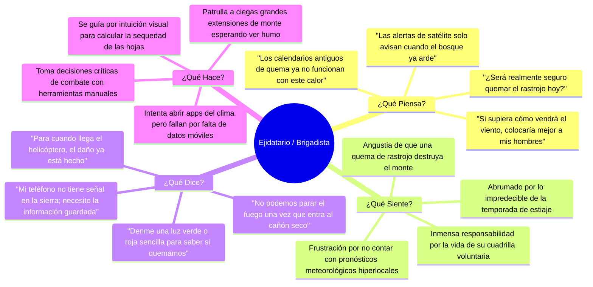

# 👥 Actores, Personas y Mapas de Empatía

El éxito de TERRA-FIRE radica en diseñar una herramienta tecnológica adaptada a los usuarios que viven y combaten el fuego en los bosques mexicanos.

---

## 1. Tabla de Identificación de Usuarios

![[assets/user-identification-table.png]]
*Figura 1: Clasificación de Grupos de Usuario para TERRA-FIRE (Sección 4 PDL).*

| Grupo de Usuario | Perfil y Características | Necesidades Operativas Centrales |
| :--- | :--- | :--- |
| **Primario: Ejidatarios y Líderes de Brigadas Comunitarias**   `[SELECCIONADO]` | Agricultores rurales y voluntarios de primera línea. Vasta experiencia empírica en campo pero baja alfabetización digital. Operan en áreas montañosas con cero cobertura móvil. | Saber **cuándo y dónde** patrullar preventivamente. Requerimiento de alertas visuales muy simples (semáforos verde/rojo) accesibles sin internet para programar quemas agrícolas seguras. |
| **Secundario: Despachadores Operativos CONAFOR** | Coordinadores tácticos regionales certificados en el Sistema de Comando de Incidentes (ICS). Administran presupuestos y despliegues de cuadrillas oficiales. | Mapas de probabilidad de ignición a 48–72 horas a resolución de 10–20 m para pre-posicionar camiones cisterna y brigadas oficiales. |
| **Terciario: Analistas de Riesgo de Protección Civil** | Oficiales de gobierno encargados de emitir declaratorias de emergencia y evacuaciones en la Interfaz Urbano-Forestal. | Modelos transparentes y explicables (XAI / SHAP) que justifiquen técnicamente órdenes de moratoria o evacuación preventiva ante la población. |

---

## 2. Arquetipos de Usuario (Personas)

### Persona Primaria: Don Manuel (52 años)
- **Rol:** Comisariado Ejidal y Jefe de Brigada Forestal Voluntaria en la Sierra Madre.
- **Contexto:** Cultiva maíz y frijol; organiza la limpieza de rastrojo previo a la temporada de siembra. Su teléfono es un Android de gama de entrada con batería limitada y sin señal celular en el bosque.
- **Frustración Mayor:** *"Nos enteramos de que una quema se salió de control cuando ya vemos el humo elevarse en la cañada; si supiéramos que el aire va a cambiar en la tarde, no prenderíamos fuego."*
- **Meta:** Proteger las parcelas del ejido, evitar multas o tragedias y asegurar que sus brigadistas regresen a salvo a casa.

### Persona Secundaria: Ing. Claudia (38 años)
- **Rol:** Despachadora Operativa en el Centro de Control de Incendios de CONAFOR.
- **Contexto:** Coordina 6 brigadas oficiales y 2 helicópteros cisterna sobre un área de más de 400,000 hectáreas con escasez de estaciones meteorológicas terrestres.
- **Frustración Mayor:** *"Los reportes satelitales de calor nos llegan con horas de retraso. Enviamos a la brigada y cuando llegan 3 horas después, el fuego saltó de 1 hectárea a 50 hectáreas."*
- **Meta:** Disponer de un mapa predictivo 72 horas antes que le permita decir: *"Mañana concentraremos los recursos en esta cañada específica."*

---

## 3. Mapa de Empatía (Ejidatario / Brigadista Rural)

![[assets/empathy-map-ejidatario.png]]
*Figura 2: Mapa de Empatía centrado en el usuario primario de campo (Sección 5 PDL).*

---
*Notas vinculadas:* [[01 - Problem Definition & Context]] | [[03 - User Journey & Pain Points]] | [[Offline-First Edge Architecture]]
