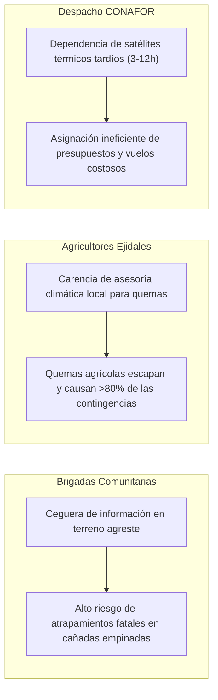

# 🚶 User Journey Map, Análisis de Necesidades y Matriz de Dolores

---

## 1. User Journey Map: De la Reacción a la Predicción

![[assets/user-journey-map.png]]
*Figura 1: Mapeo del Recorrido del Usuario y Oportunidades TERRA-FIRE (Sección 6 PDL).*

| Fase del Recorrido | 1. Preparación de Quema Agrícola | 2. Monitoreo de Riesgo Forestal | 3. Ignición y Escape de Fuego | 4. Supresión y Combate Activo |
| :--- | :--- | :--- | :--- | :--- |
| **Acciones del Usuario** *(Flujo Actual)* | El campesino prepara la quema del rastrojo. Mira al cielo para adivinar el viento. | Sube a una torre visual o camina ciegamente por la sierra patrullando. | Detecta una columna de humo tardía. Se percata de que la quema brincó la guardarraya. | Ingresa a la cañada con azadones y mochilas aspersoras. Pierde toda señal celular. |
| **Dolores Operativos** *(Falta de Predicción)* | **Adivinación Climática:** El cambio climático inutiliza los calendarios tradicionales; ráfagas súbitas de viento. | **Deshidratación Invisible:** Incapacidad humana de medir la desecación del dosel arbóreo en cañones profundos. | **Satélites Lentos:** Las alertas térmicas de NASA FIRMS llegan entre 3 y 12 horas tras la ignición. | **Desconexión Total:** Las plataformas sofisticadas no sirven si exigen conexión 4G continua en el frente de fuego. |
| **Oportunidades TERRA-FIRE** | **Ventana Segura de Quema:** Semáforo microclimático predictivo (verde/rojo) basado en viento y humedad ERA5. | **Pronóstico Espacial a 72h:** Sentinel-2 calcula NDMI e identifica píxeles críticos de 10 m con 3 días de antelación. | **Pre-despliegue Preventivo:** Las cuadrillas ya estaban apostadas cerca de la zona señalada por el modelo. | **Arquitectura PWA Offline:** Mapas vectoriales precargados localmente y navegación funcional sin red celular. |
| **Sentimiento del Usuario** | *Incertidumbre / Adivinanza* 🟡 | *Frustración / Ceguera* 🟠 | *Pánico / Reacción Tardía* 🔴 | *Riesgo Extremo / Atrapamiento* 🛑 |

---

## 2. Análisis de Necesidades Operativas

![[assets/needs-analysis.png]]
*Figura 2: Jerarquización de Necesidades del Usuario (Sección 7 PDL).*

| Necesidad del Usuario | Nivel de Importancia | Justificación Basada en Evidencia |
| :--- | :--- | :--- |
| **Pronósticos Pre-Ignición a 72 Horas** | **Crítica (Tier 1)** | Los sistemas actuales solo reaccionan cuando el fuego ya inició. Las brigadas requieren ventanas temporales de anticipación para planear rutas y descansos. |
| **Accesibilidad Total sin Conexión (Offline)** | **Crítica (Tier 1)** | Más del 85% de las áreas boscosas bajo riesgo en México carecen de red de telecomunicaciones comerciales. Una solución que requiera red en vivo es inútil en campo. |
| **Avisos Microclimáticos de Quema Segura** | **Alta (Tier 2)** | Los agricultores causan inadvertidamente más del 80% de los siniestros. Brindarles una recomendación preventiva no punitiva elimina el riesgo en origen. |

---

## 3. Matriz de Puntos de Dolor (Pain Point Matrix)

![[assets/pain-point-matrix.png]]
*Figura 3: Matriz de Dolores y Consecuencias Sistémicas (Sección 8 PDL).*

---
*Notas vinculadas:* [[02 - Stakeholders & Empathy Maps]] | [[04 - Ideation, HMW & Concept Evaluation]] | [[Offline-First Edge Architecture]]
