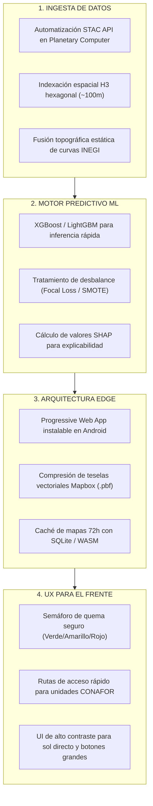

# 💡 Ideación, Preguntas HMW y Evaluación de Conceptos

---

## 1. Matriz de Preguntas HMW (How Might We?)

![[assets/hmw-question-matrix.png]]
*Figura 1: Matriz de Preguntas HMW y Características de Solución (Sección 11 PDL).*

| Pregunta HMW (¿Cómo Podríamos?) | Resultado Esperado / Característica de la Solución |
| :--- | :--- |
| **¿Cómo podríamos pronosticar la probabilidad espacial de ignición 48–72h antes en biomas diversos?** | Motor predictivo de Machine Learning (**XGBoost**) entrenado con incendios históricos, humedad satelital NDMI y clima local. |
| **¿Cómo podríamos entregar mapas predictivos complejos a brigadas rurales en zonas sin señal celular?** | Progressive Web App (**PWA**) con arquitectura *Offline-First* y almacenamiento en caché de teselas vectoriales (SQLite/WASM). |
| **¿Cómo podríamos empoderar a los ejidatarios para programar sus quemas agrícolas con seguridad?** | Herramienta de *"Aviso de Quema Segura"* basada en microclima, que muestra un semáforo Verde/Rojo simple según viento y humedad ERA5. |
| **¿Cómo podríamos generar confianza institucional en las predicciones para CONAFOR y Protección Civil?** | Panel de Inteligencia Artificial Explicable (**TreeSHAP**) que desglosa los factores de riesgo de cada polígono (ej. pendiente + deshidratación). |
| **¿Cómo podríamos optimizar el pre-despliegue de recursos aéreos y terrestres antes de una contingencia?** | Mapas de ruteo táctico guiados por datos que señalan corredores de riesgo extremo, reduciendo tiempos de arribo de horas a minutos. |

---

## 2. Priorización de Oportunidades: Impacto vs Factibilidad

![[assets/impact-vs-feasibility.png]]
*Figura 2: Cuadrante de Priorización de Oportunidades para TRL 1-2 (Sección 12 PDL).*

- **Prioridad 1: Iniciativas Centrales (Alto Impacto + Alta Factibilidad):**
  1. *Motor Predictivo Satelital a 10 m (Sentinel-2 + XGBoost):* Impacto muy alto, factibilidad técnica alta mediante datos abiertos Copernicus.
  2. *PWA Móvil Offline-First:* Resuelve la brecha de conectividad rural con alta factibilidad web moderna.
- **Apuestas Estratégicas (Alto Impacto + Mayor Complejidad):**
  - *Asesorías de Quema Ejidal (4):* Gran valor social pero requiere trabajo de gobernanza comunitaria.
  - *Fusión con Radar SAR Sentinel-1 (5):* Permite penetrar nubes densas pero añade complejidad matemática.
- **Ganancias Incrementales (Impacto Moderado + Factibilidad Inmediata):**
  - *Capa de Explicabilidad SHAP (3):* Despliegue de valores de atribución de variables para generar confianza en analistas.

---

## 3. Tablero de Lluvia de Ideas (Brainstorming Board)

![[assets/brainstorming-board.png]]
*Figura 3: Tablero de Ideación Técnica en 4 Columnas (Sección 13 PDL).*

---

## 4. Matriz Ponderada de Selección de Concepto

![[assets/concept-evaluation-matrix.png]]
*Figura 4: Evaluación Multicriterio de Alternativas Tecnológicas (Sección 14 PDL).*

| Criterio de Selección | Peso | Concepto A: Malla de Sensores IoT Terrestres (LoRaWAN) | Concepto B: SIG Comercial en la Nube (Propietario) | Concepto C: TERRA-FIRE (Sentinel 10m + PWA Offline + SHAP) |
| :--- | :---: | :---: | :---: | :---: |
| **Impacto Socio-Ecológico** | 25% | **3.0** (Datos de suelo locales pero cobertura reducida a pocas hectáreas) | **4.0** (Buen resumen para directivos; no llega a comunidades) | **4.8** (Monitoreo de dosel a 10m + guía preventiva para comunidades) |
| **Factibilidad Técnica** | 25% | **2.0** (Baterías agotadas, vandalismo y logística en sierras) | **4.5** (Nube madura pero amarrada a licencias privativas) | **4.6** (APIs abiertas gratuitas de Copernicus y tecnologías web estándar) |
| **Usabilidad Operativa** | 20% | **3.0** (Requiere mantener gateways de radio físicos) | **1.5** (Inutilizable en cañadas por dependencia de 4G continuo) | **4.7** (Caché local offline permite navegación continua sin cobertura) |
| **Costo y Escalabilidad** | 15% | **2.0** (Costo prohibitivo para instrumentar cordilleras enteras) | **2.5** (Suscripciones comerciales recurrentes en dólares) | **4.5** (Cero costo de hardware; escala a nivel nacional por software) |
| **Adopción de Usuarios** | 15% | **3.5** (Directo para agricultores pero sin contexto regional) | **3.0** (Rechazado por brigadas rurales por exceso de complejidad) | **4.6** (Interfaz intuitiva por colores + explicabilidad técnica para CONAFOR) |
| **TOTAL PONDERADO** | **100%** | **2.82 / 5.0** | **3.35 / 5.0** | **4.63 / 5.0 (SELECCIONADO)** |

---
*Notas vinculadas:* [[03 - User Journey & Pain Points]] | [[05 - Solution Concept & TRL Assessment]] | [[02 - Industrial Evolution & Tech Radar]]
