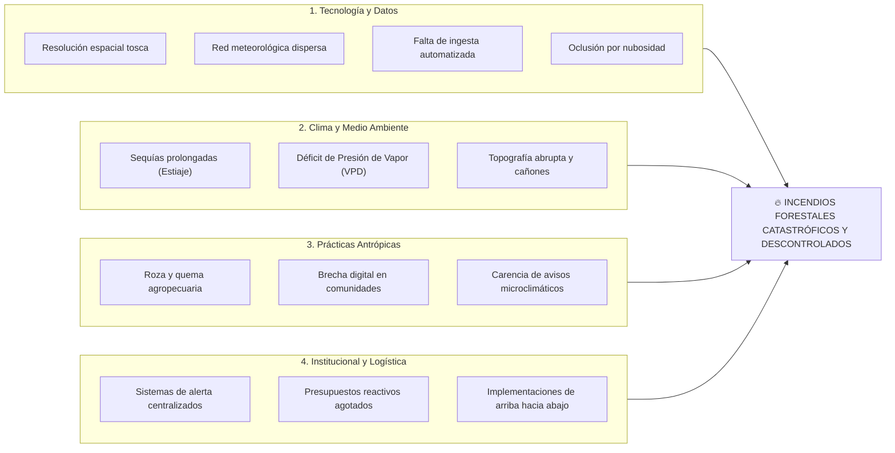

# 🇲🇽 Reto Nacional y Contexto Estratégico: Incendios Forestales en México

> [!abstract] Alineación al Eje Estratégico Nacional
> La exploración de este reto tecnológico se fundamenta directamente en las prioridades de soberanía científica y resiliencia ambiental delineadas por la Secretaría de Ciencia, Humanidades, Tecnología e Innovación (**SECIHTI**), específicamente en su **Eje Estratégico 4: Ecosistemas Forestales y Manejo Integral del Fuego**.

---

## 1. Contexto del Reto Macro

Los incendios forestales constituyen una de las mayores amenazas ambientales, sociales y económicas en México y América Latina. Históricamente, la estimación del peligro de fuego a nivel federal se ha basado en el **Índice Meteorológico de Incendios Forestales de Canadá (FWI)**, adaptado por la Comisión Nacional Forestal (**CONAFOR**) dentro del Sistema de Predicción de Peligro de Incendios Forestales (**SPPIF**).

### Limitaciones Estructurales del Sistema Tradicional:
- **Escasa Red Meteorológica de Superficie:** La red nacional de estaciones meteorológicas automatizadas (EMA) es altamente dispersa en terrenos montañosos, existiendo a menudo menos de 1 estación por cada 2,500 km² en biomas forestales críticos.
- **Resolución Espacial Sumamente Tosca:** La interpolación climática genera cuadrículas regionales de varios kilómetros que promedian la temperatura y humedad, ignorando por completo el microclima de cañadas sombrías o laderas expuestas a radiación solar intensa.
- **Falta de Monitoreo Dinámico de Vegetación:** El FWI calcula la desecación del combustible mediante fórmulas empíricas basadas en lluvia pasada, pero **no mide directamente el estrés hídrico real** del follaje vivo de los árboles.
- **Retraso Operativo y Asimetría:** Los centros de mando se enteran del fuego cuando las columnas de humo son visibles o cuando los satélites térmicos en órbita polar detectan la anomalía con varias horas de retraso.

---

## 2. Análisis de Causa Raíz (Diagrama de Ishikawa)

![[assets/root-cause-ishikawa.png]]
*Figura 1: Diagrama de Causa Raíz / Espina de Pescado (Ishikawa) para Incendios Descontrolados (Sección 4 FCE).*

### Factores Críticos Identificados:
1. **Tecnología y Datos:** Ausencia de pipelines de ingesta automatizados que procesen en tiempo real datos satelitales de alta resolución espacial.
2. **Clima y Medio Ambiente:** La intensificación de eventos climáticos extremos eleva exponencialmente el Déficit de Presión de Vapor (VPD), creando una "fuerza de succión" atmosférica que seca la vegetación en cuestión de horas.
3. **Prácticas Antrópicas:** El fuego es una herramienta indispensable para el campesino mexicano que prepara sus tierras de cultivo; la falta de avisos preventivos accesibles provoca que quemas ordinarias se conviertan en conflagraciones masivas.
4. **Logística e Instituciones:** La rigidez de los protocolos reactivos de combate consume el presupuesto en operaciones aéreas de emergencia (horas de helicóptero), dejando a las brigadas de a pie sin herramientas de prevención.

---
*Notas vinculadas:* [[02 - Industrial Evolution & Tech Radar]] | [[03 - Disruptive Convergence]] | [[01 - Problem Definition & Context]]
