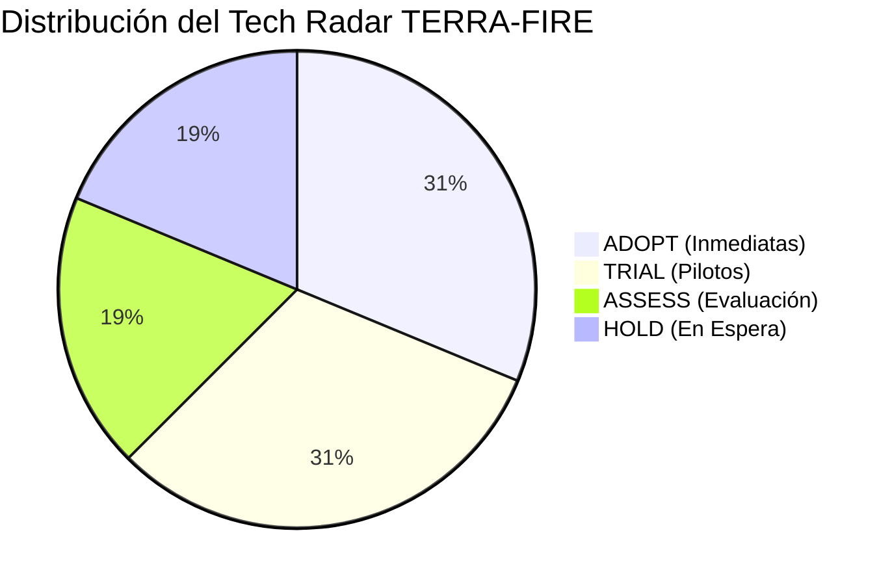

# 📡 Evolución Industrial y Radar de Tecnologías Forestales

---

## 1. La Evolución de las Revoluciones Industriales en la Gestión del Fuego

| Revolución | Época | Característica Tecnológica General | Aplicación en Manejo del Fuego | Limitación Principal |
| :--- | :--- | :--- | :--- | :--- |
| **Industria 1.0** | S. XVIII–XIX | Vapor, mecanización básica y telégrafo. | Torres visuales de madera, vigilantes montados a caballo y campanas de alarma. | Cobertura estrictamente de línea de visión; tiempos de respuesta de días. |
| **Industria 2.0** | Principios S. XX | Electricidad, combustión interna y producción en masa. | Camiones cisterna, radiocomunicación analógica (VHF/HF) y avionetas de patrullaje visual. | Fuerte dependencia de infraestructura física y combustible fósil; combate reactivo. |
| **Industria 3.0** | Finales S. XX | Computación, satélites meteorológicos iniciales (NOAA) e internet. | Sistemas de Información Geográfica (SIG) de escritorio y modelos meteorológicos regionales computarizados. | Datos estáticos con días de retraso; análisis centralizado en laboratorios urbanos. |
| **Industria 4.0** | 2010–Actualidad | Computación en la nube, IoT, Big Data, satélites multiespectrales (Copernicus) e IA. | Predicción satelital continua, constelaciones de radar SAR, pipelines automatizados y Machine Learning. | **Brecha de última milla:** El conocimiento de la nube no llega a los combatientes sin internet. |
| **Industria 5.0** | Futuro Emergente | Simbiosis humano-tecnología, IA centrada en el humano, resiliencia ecológica y soberanía de datos. | **TERRA-FIRE:** IA explicable (XAI) que empodera al campesino rural, cartografía táctica offline e interfaces adaptadas a personas mayores. | Requiere cambios culturales, confianza institucional y gobernanza ética de datos. |

---

## 2. Radar de Tecnologías para Predicción de Riesgo de Incendios

![[assets/tech-radar-wildfire.png]]
*Figura 1: Wildfire Risk Prediction Tech Radar (Sección 6 FCE).*

El radar categoriza 16 tecnologías emergentes distribuidas en **4 Cuadrantes** y **4 Anillos de Adopción**:
- **ADOPT (Adoptar Inmediatamente):** Tecnologías maduras, accesibles, de alto impacto y bajo costo de despliegue.
- **TRIAL (Probar en Pilotos):** Tecnologías con enorme potencial que deben evaluarse en entornos de laboratorio o piloto controlado.
- **ASSESS (Evaluar / Prospectar):** Tecnologías emergentes de alta complejidad que deben vigilarse de cerca.
- **HOLD (Poner en Espera):** Soluciones con altos costos, baja madurez o fricción operacional inasumible en México.

### Detalle por Cuadrante:

#### Cuadrante 1: Observación Terrestre y Datos (Earth Observation & Data)
- **1. Sentinel-2 & Landsat-9 (ADOPT):** Imágenes multiespectrales de libre acceso a 10–30 m con reflectancia BOA para derivar NDMI y SAVI.
- **2. NASA FIRMS Hotspots (ADOPT):** Detección de anomalías térmicas (VIIRS 375m) utilizada como variable objetivo histórica.
- **3. Sentinel-1 SAR Radar (TRIAL):** Microondas banda C para penetrar nubes densas y estimar humedad superficial de biomasa.
- **4. Video Satelital en Tiempo Real HD (HOLD):** Costo prohibitivo en constelaciones privadas comerciales y volumen de datos inmanejable.

#### Cuadrante 2: IA y Analítica Predictiva (AI & Predictive Analytics)
- **5. XGBoost & LightGBM (ADOPT):** Árboles de decisión gradient boosted para inferencia espacial rápida sobre millones de vóxeles.
- **6. Redes Neuronales U-Net (TRIAL):** Segmentación semántica raster-to-raster para modelado continuo de cicatrices de fuego.
- **7. Redes Informadas por la Física - PINNs (TRIAL):** Ecuaciones diferenciales parciales de propagación térmica integradas en redes profundas.
- **8. Vision Transformers - ViT (ASSESS):** Modelos fundacionales geoespaciales (tipo Prithvi de NASA/IBM) de alta demanda computacional.

#### Cuadrante 3: Operaciones de Campo y Edge (Edge & Field Operations)
- **9. PWA Offline & Caché de Teselas (ADOPT):** Arquitectura web moderna para consultar mapas vectoriales sin red móvil.
- **10. Redes IoT LoRaWAN Microclimáticas (TRIAL):** Sensores de bajo consumo para calibrar anomalías de viento en cañadas críticas.
- **11. Drones Térmicos de Patrullaje Autónomo (ASSESS):** UAVs con cámaras FLIR para inspección rápida de perímetros sospechosos.
- **12. Robots Terrestres Autónomos de Supresión (HOLD):** Inviables en la topografía accidentada y vegetación densa de México.

#### Cuadrante 4: Plataformas y Gobernanza (Platforms & Governance)
- **13. Google Earth Engine / Planetary Computer (ADOPT):** Cómputo geoespacial masivo en la nube para procesamiento por lotes.
- **14. Registro Descentralizado de Quemas / Blockchain (ASSESS):** Contratos inteligentes para trazabilidad de permisos ejidales sin corrupción.

---
*Notas vinculadas:* [[01 - National Challenge & Strategic Context]] | [[03 - Disruptive Convergence]] | [[04 - Future Scenarios 2026-2036]]
