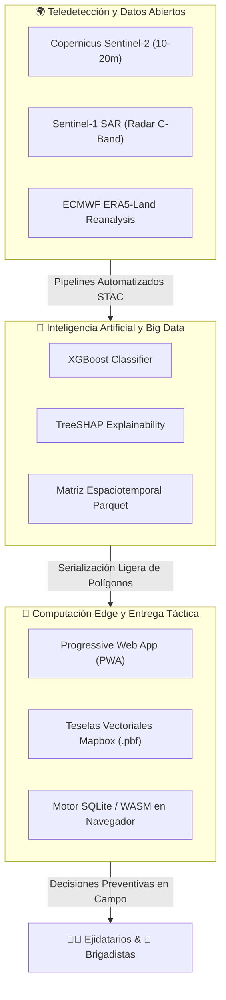

# 🌀 Convergencia Tecnológica Disruptiva en TERRA-FIRE

> [!tip] Concepto de Convergencia
> La verdadera innovación no reside en una tecnología aislada, sino en la **convergencia sinérgica** de disciplinas que históricamente operaban en silos: Teledetección Espacial, Computación Científica en la Nube, Aprendizaje Automático y Arquitecturas Web Offline.

---

## 1. El Triángulo de Convergencia de TERRA-FIRE

---

## 2. Análisis de Sinergias y Fricciones Superadas

### Sinergia 1: Satélites Ópticos + Reanálisis Atmosférico
- *El problema tradicional:* Las imágenes ópticas de Sentinel-2 miden la humedad del follaje cada 5 días, pero no miden las ráfagas horarias de viento ni la sequedad del aire. El reanálisis climático ERA5 mide la atmósfera pero a una resolución tosca de 9 km.
- *La convergencia:* Mediante **downscaling topográfico adiabático**, TERRA-FIRE acopla la demanda atmosférica (VPD) horaria a la malla espacial de 10 m de Sentinel-2 y a las curvas de nivel del DEM GLO-30.

### Sinergia 2: Machine Learning Pesado + Dispositivos Móviles Económicos
- *El problema tradicional:* Los modelos de Inteligencia Artificial requieren servidores potentes con GPUs o CPUs multihilo; los teléfonos de los ejidatarios rurales son de gama baja y carecen de conexión en la sierra.
- *La convergencia:* El modelo XGBoost corre **enteramente en la nube** (batch nocturno diario a las 02:00 UTC). Lo que se envía al dispositivo móvil no es el modelo ni pesadas imágenes ráster GeoTIFF, sino una **capa vectorial altamente comprimida** (`.pbf`) de menos de 15 MB por municipio.

### Sinergia 3: IA Explicable (XAI) + Sabiduría Comunitaria
- *El problema tradicional:* Los modelos de "caja negra" son rechazados por campesinos experimentados y por analistas de Protección Civil que no entienden por qué el sistema marca una alerta roja.
- *La convergencia:* Mediante valores **SHAP**, la plataforma desglosa los motivos exactos de la advertencia: *"Alerta roja porque el viento superará 35 km/h a las 14:00 hrs y la humedad del dosel está 40% por debajo de lo normal"*. Esto valida la experiencia del agricultor y construye confianza mutua.

---
*Notas vinculadas:* [[02 - Industrial Evolution & Tech Radar]] | [[04 - Future Scenarios 2026-2036]] | [[End-to-End System Pipeline]]
