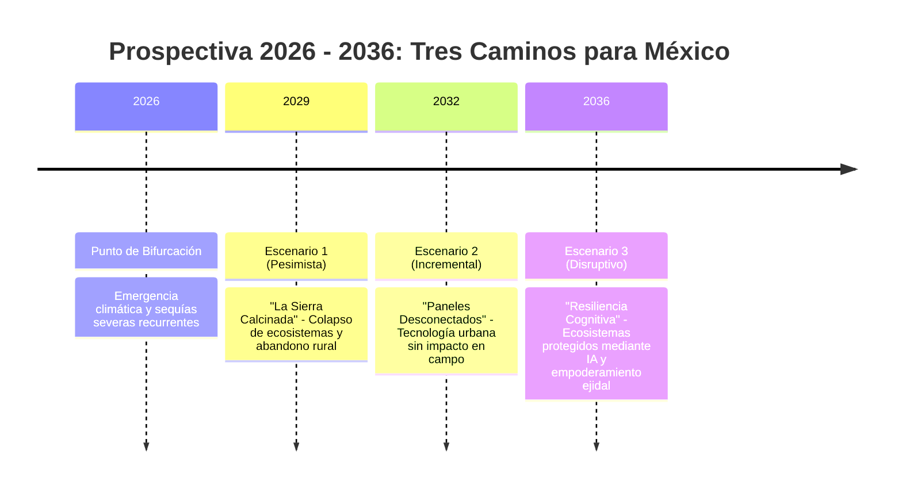

# 🔮 Escenarios Prospectivos 2026–2036: El Futuro del Fuego en México

Mediante técnicas de prospectiva tecnológica, se proyectan 3 futuros posibles para la próxima década según el nivel de adopción e inversión tecnológica en el país.

---

## 1. Los Tres Escenarios Futuros

---

### Escenario 1: Pesimista / Status Quo — *"La Sierra Calcinada"*
- **Premisa:** Se mantiene el paradigma reactivo actual. No se actualiza el sistema SPPIF de CONAFOR y el presupuesto público se sigue consumiendo en contratos de emergencia para renta de helicópteros privados de combate.
- **Narrativa (2036):** La prolongación del estiaje por el cambio climático hace que los incendios se vuelvan incontrolables año con año. Bosques enteros en Michoacán, Oaxaca y la Sierra Madre se convierten en matorrales desérticos. La pérdida de acuíferos agrava la crisis de agua en ciudades centrales. Las brigadas rurales comunitarias se desintegran tras múltiples tragedias de atrapamiento mortal. Las comunidades abandonan el campo, sumándose a la migración forzada por el clima.

### Escenario 2: Incremental — *"Paneles Desconectados"*
- **Premisa:** Las agencias gubernamentales contratan costosos tableros comerciales de SIG en la nube (software privativo extranjero) con visualizaciones complejas para directores en la Ciudad de México, pero sin resolver la conectividad de campo.
- **Narrativa (2036):** Los mandos medios cuentan con salas de crisis con mapas interactivos de ultra alta resolución. Sin embargo, en la sierra, Don Manuel y sus compañeros de brigada siguen sin tener acceso a la información en sus teléfonos. Los incendios siguen empezando por quemas agrícolas mal calculadas porque el campesino nunca recibió un aviso en su idioma y sin internet. Se gastan millones de dólares en licencias de software sin impactar la curva de hectáreas quemadas.

### Escenario 3: Transformacional / Disruptivo — *"Resiliencia Cognitiva 2036"* `[VISIÓN TERRA-FIRE]`
- **Premisa:** Adopción plena de la convergencia tecnológica abierta, combinando satélites Copernicus, modelos de Machine Learning (XGBoost/SHAP) y Progressive Web Apps offline en manos de ejidatarios.
- **Narrativa (2036):** México se consolida como referente global en manejo integrado del fuego. En cada ejido, los campesinos consultan su PWA de TERRA-FIRE antes de encender una guardarraya. Los comisariados coordinan quemas prescritas únicamente en ventanas de semáforo verde. Cuando las condiciones climáticas indican riesgo extremo de escape a 72 horas, las alertas disparan patrullajes preventivos conjuntos entre brigadas comunitarias y Protección Civil. El área forestal quemada anualmente disminuye en más de un **65%**, y los recursos públicos se destinan al enriquecimiento forestal y pago por servicios ambientales.

---

## 2. Factores de Cambio y Señales Débiles (Signposts)

| Factor Clave | Señal Actual (2026) | Hito Crítico (2030) | Meta Deseable (2036) |
| :--- | :--- | :--- | :--- |
| **Política Científica** | SECIHTI prioriza el Manejo Integral del Fuego en el Eje 4. | Financiamiento de pilotos predictivos en sierras de alta biodiversidad. | Adopción de TERRA-FIRE como estándar del Sistema Nacional de Protección Civil. |
| **Conectividad Satelital** | Dependencia de redes celulares terrestres deficientes. | Despliegue de constelaciones LEO de bajo costo para sincronización rural. | Sincronización en tiempo real vía satelital directa al teléfono (Direct-to-Cell). |
| **Cultura Comunitaria** | Fricción y desconfianza hacia prohibiciones de quemas impuestas desde el centro. | Comités ejidales capacitados en interpretación de alertas semafóricas. | Autogestión comunitaria del riesgo climática sustentada en datos abiertos. |

---
*Notas vinculadas:* [[03 - Disruptive Convergence]] | [[05 - Impact Analysis & Ethics]] | [[05 - Solution Concept & TRL Assessment]]
