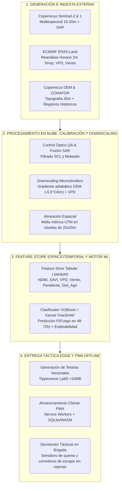

# 🌪️ Las 5Vs de Big Data y Arquitectura del Ecosistema

---

## 1. Análisis de las 5 Dimensiones de Big Data (5Vs)

![[assets/big-data-5vs-analysis.png]]
*Figura 1: Evaluación de las 5Vs en la Infraestructura de TERRA-FIRE (Sección 4 DOM).*

| Dimensión "V" | Análisis en TERRA-FIRE | Impacto en la Arquitectura y Estrategia Analítica |
| :--- | :--- | :--- |
| **VOLUMEN**   *(Terabytes de Ráster)* | Múltiples gigabytes por escena de Sentinel-2 (13 bandas a 10–20 m) sumados a cubos multianuales de reanálisis ERA5-Land para todo el territorio mexicano. | - Almacenamiento en nube de objetos (AWS S3 / GEE) en lugar de discos locales.   - Uso de Cloud-Optimized GeoTIFFs (COGs) y extracción de sub-regiones (*bounding boxes*).   - Transformación de rásters pesados a muestras tabulares compactas en **Apache Parquet**. |
| **VELOCIDAD**   *(Cadencia de 5 Días a Horaria)* | Sentinel-2 revisita la misma región cada 5 días; ERA5-Land produce actualizaciones horarias continuas. Las inferencias requieren lotes diarios a 48–72h. | - Flujos programados (*cron*) en Apache Airflow o Cloud Functions.   - Disparadores de ETL incremental al confirmarse nueva escena satelital libre de nubes.   - Rutinas de inferencia masiva ejecutadas en horarios de baja demanda (02:00 UTC). |
| **VARIEDAD**   *(Multiformato Espacial y Tabular)* | Fusión de rásters GeoTIFF de 16 bits, tensores climáticos NetCDF-4/GRIB2, vectores de caminos (OSM) y registros tabulares relacionales (CONAFOR). | - Capa de armonización y reproyección unificada a mallas métricas UTM.   - Mínimo común espacial: vóxeles regulares de $20\times20$ m.   - Conversión a matrices columnares unificadas en formato Parquet. |
| **VERACIDAD**   *(Ruido Atmosférico y Errores)* | Oclusión por nubes densas y sombras de relieve. Errores de registro humano en coordenadas de inicio de incendio en bitácoras oficiales. | - Filtrado por máscara de calidad espectral (*Scene Classification Layer - SCL*).   - Respaldo de humedad con radar SAR de microondas (Sentinel-1).   - Cruce de coordenadas CONAFOR con detecciones de calor térmico NASA FIRMS. |
| **VALOR**   *(Ventana Operativa de 72 Horas)* | Transformación de terabytes de ruido planetario en teselas de riesgo de 10 m y explicabilidad clara en campo. | - Alto retorno de inversión: cero gasto en compra o reposición de sensores físicos.   - Ventana de acción preventiva de 48–72h para salvaguardar vidas y bosques.   - Entrega ultraligera (<15 MB) de teselas vectoriales en Progressive Web App. |

---

## 2. Arquitectura del Ecosistema de Datos TERRA-FIRE

![[assets/data-ecosystem-architecture.png]]
*Figura 2: Flujo de Datos Extremo a Extremo de TERRA-FIRE (Sección 5 DOM).*

---
*Notas vinculadas:* [[02 - Data Source Catalog & Ingestion]] | [[04 - Feature Taxonomy & Prioritization]] | [[End-to-End System Pipeline]]
