# ⚙️ Pipeline Técnico Extremo a Extremo (End-to-End)

Este documento detalla la arquitectura de software, flujo de datos y dependencias de ejecución entre el backend satelital en la nube y el cliente táctico en campo.

---

## 1. Diagrama de Flujo del Pipeline Completo

```mermaid
flowchart TD
    subgraph INGEST["1. Ingesta Satelital y Meteorológica (Cloud Batch Diario - 02:00 UTC)"]
        S2["Sentinel-2 L2A
Bandas B2, B4, B8, B11, B12 (STAC API)"]
        ERA["ERA5-Land Reanalysis
Temp 2m, Dewpoint, Viento U/V, Humedad Suelo"]
        DEM["Copernicus GLO-30 DEM
Curvas de nivel estáticas a 30m"]
        FIRMS["NASA FIRMS VIIRS 375m
Anomalías térmicas para validación"]
    end

    subgraph PREP["2. Normalización, Calibración y Downscaling"]
        SCL["Filtro de Calidad Óptica SCL
Enmascaramiento de nubes y sombras"]
        DOWNSCALE["Downscaling Topográfico
Ajuste adiabático (-6.5°C/km) y cálculo de VPD"]
        INDEXES["Cálculo de Índices Biofísicos
NDMI, SAVI, NBR sobre vóxeles de 20x20m"]
    end

    subgraph ML_TRAIN["3. Inferencia de Machine Learning (XGBoost + SHAP)"]
        PARQUET["Feature Store Tabular
terra_fire_spatiotemporal_matrix_v1.parquet"]
        XGB["Inferencia XGBoost Classifier
Cálculo de P(Ignición en 48-72h) por vóxel"]
        SHAP["Explicabilidad TreeSHAP
Identificación de factores dominantes de riesgo"]
    end

    subgraph PACKAGING["4. Serialización y Empaquetado Vectorial"]
        POLY["Vectorización de Polígonos Críticos
Agrupación de vóxeles con riesgo > umbral"]
        TIPPE["Generador Tippecanoe
Compilación de Teselas Vectoriales (.pbf) <15MB"]
        API["REST API Endpoint
GeoJSON comprimido y metadatos JSON"]
    end

    subgraph CLIENT["5. Cliente Táctico Edge (PWA Offline)"]
        SW["Service Worker Background Sync
Descarga y almacenamiento en IndexedDB / SQLite WASM"]
        MAP["Renderizado MapLibre GL
Visualización fluida a 60 FPS sin red móvil"]
        UI["Interfaz Táctica de Usuario
Semáforo de quema y corredores de escape seguros"]
    end

    INGEST --> PREP
    PREP --> ML_TRAIN
    ML_TRAIN --> PACKAGING
    PACKAGING --> CLIENT
```

---

## 2. Descripción Paso a Paso de las Etapas

1. **Ingesta Planetaria Automatizada:**
   Un servicio programado (*cron job*) en la nube ejecuta a las 02:00 UTC una consulta a la API STAC de Microsoft Planetary Computer o Google Earth Engine para descargar las últimas bandas espectrales de Sentinel-2 L2A y los tensores climáticos ERA5-Land.
2. **Preprocesamiento y Armonización Espacial:**
   - Se filtran los píxeles con nubes mediante la capa de clasificación de escena (*Scene Classification Layer - SCL*).
   - Se ajusta la temperatura a nivel de cañada restando $0.0065^\circ C$ por cada metro de elevación respecto al promedio regional del DEM.
   - Se calcula el Déficit de Presión de Vapor ($VPD = e_s - e_a$) en kilopascales ($kPa$).
3. **Inferencia y Explicabilidad:**
   La matriz de características normalizada se alimenta al modelo serializado XGBoost. Para cada celda de $20\times20$ m se computa la probabilidad de ignición y los 3 factores que más contribuyen al riesgo según TreeSHAP.
4. **Empaquetado Ultraligero:**
   Para evitar que el teléfono en campo tenga que procesar imágenes pesadas, la herramienta `tippecanoe` convierte los polígonos de alerta en teselas vectoriales compactas (`.pbf`).
5. **Sincronización Previa y Desconexión:**
   Cuando el brigadista o campesino tiene acceso a internet en el pueblo o la cabecera municipal, la Progressive Web App descarga la tesela de su municipio. Al adentrarse en la sierra sin cobertura celular, el mapa funciona al 100% de manera local.

---
*Notas vinculadas:* [[Feature Store & Parquet Schema]] | [[Offline-First Edge Architecture]] | [[03 - Big Data 5Vs & Ecosystem Architecture]]
