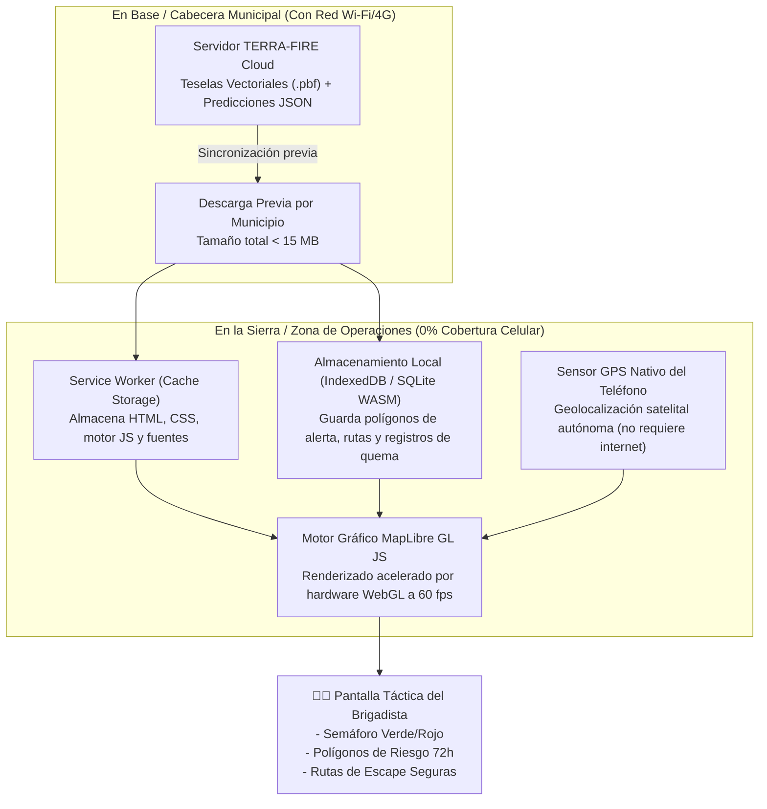

# 📱 Arquitectura Offline-First y Entrega Táctica Edge

La mayor debilidad de las plataformas tradicionales de información geográfica es su dependencia de conexiones 4G/5G estables. En las sierras mexicanas, la conectividad es nula. **TERRA-FIRE está diseñado desde el código base bajo una filosofía 100% Offline-First**.

---

## 1. Componentes de la Arquitectura de Cliente Táctico

---

## 2. Tecnologías y Protocolos Seleccionados

1. **Progressive Web App (PWA):**
   - Se instala directamente desde el navegador en cualquier smartphone Android o iOS sin pasar por las restricciones de Google Play o Apple App Store.
   - Consume menos de **30 MB de almacenamiento total** en el dispositivo.
2. **Teselas Vectoriales Mapbox (`.pbf`):**
   - En lugar de descargar pesados mapas ráster satelitales (que pesan cientos de megabytes), el servidor compila los polígonos de riesgo en teselas vectoriales binarias utilizando `tippecanoe`.
   - Permite zoom continuo y nitidez vectorial con un consumo de datos ínfimo (<15 MB por municipio).
3. **Persistencia Local con SQLite compilado a WASM:**
   - La base de datos local gestiona el estado de quemas, metadatos y explicaciones de riesgo sin necesidad de servidor remoto.
4. **Diseño de Interfaz de Usuario para Exteriores (Outdoor UI/UX):**
   - **Contraste Extremo:** Diseñada para ser legible bajo la intensa luz solar directa en la montaña.
   - **Botones Grandes y Tipografía Clara:** Operable con guantes de trabajo o manos sucias de tierra/ceniza.
   - **Lenguaje Semafórico:** Traducción de probabilidades complejas en 3 estados intuitivos:
     - 🟢 **Verde (Bajo Peligro):** Ventana segura para quema agrícola matutina controlada.
     - 🟡 **Amarillo (Peligro Moderado):** Quema restringida; requiere cuadrilla de vigilancia reforzada.
     - 🔴 **Rojo (Peligro Crítico):** Prohibición absoluta de quemas; alto riesgo de escape y propagación explosiva.

---
*Notas vinculadas:* [[End-to-End System Pipeline]] | [[02 - Stakeholders & Empathy Maps]] | [[03 - User Journey & Pain Points]]
