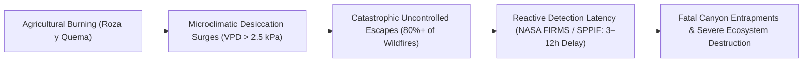
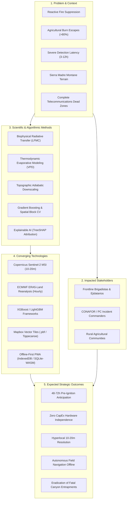

---\ntitle: "Research Problem & Questions"\nproject: "TERRA-FIRE"\ntags:\n  - scientific-intelligence\n  - terra-fire\n---\n\n## 1. Research Problem Summary

### 1.1. Context and Problem Statement
In Mexico, wildfire management operates historically and structurally under a **reactive suppression paradigm**. Current institutional decision-support mechanisms—primarily the *Sistema de Predicción de Peligro de Incendios Forestales* (SPPIF) operated by the National Forestry Commission (*Comisión Nacional Forestal*, CONAFOR) and orbital thermal anomaly alerts from NASA FIRMS (VIIRS/MODIS)—activate intervention protocols only after an active fire has already been detected. This detection typically occurs between **3 and 12 hours after ignition**, when smoke plumes become visible or thermal radiation exceeds sensor thresholds (CONAFOR, 2024; Giglio et al., 2016). By the time ground crews are dispatched, fires have frequently breached critical containment thresholds, driven by steep montane topography and desiccating afternoon winds.

According to official statistics from the *Sistema Nacional de Información Forestal* (SNIF), more than **80% of catastrophic wildfires in Mexico originate from traditional agricultural clearing practices** (*quemas agropecuarias*, specifically *roza y quema*) that escape human control due to unpredicted, localized microclimatic shifts in relative humidity, wind velocity, and ambient vapor pressure deficit (CONAFOR, 2024).

### 1.2. Population and Systems Affected
The operational deficit directly impairs three vital stakeholder groups:
1. **Frontline Forest Brigades and Volunteer Ejidatarios:** Personnel operate in steep canyon biomes without micro-scale tactical intelligence, exposing crews to fatal fireline entrapments (*atrapamientos en cañadas*) caused by sudden wind reversals and rapid uphill fire propagation.
2. **Ejido Agricultural Producers and Rural Communities:** Smallholders rely on ancestral agricultural calendars that have been rendered unreliable by climate change. Lacking localized advisories, their legitimate clearing burns turn into uncontrolled conflagrations, destroying rural capital, communal forest assets, and human settlements.
3. **Institutional Dispatchers (CONAFOR and Civil Protection):** Emergency centers expend unsustainable portions of their annual operational budgets on reactive aerial suppression (helicopter flight hours, retardant drops, and emergency mobilization) rather than targeted pre-ignition prevention.

### 1.3. Innovation Opportunity and Need for Scientific Evidence
The innovation opportunity investigated by **TERRA-FIRE** is the formulation of a **zero-hardware-cost (Zero CapEx) predictive system** that fuses multi-spectral Earth Observation (Copernicus Sentinel-2 MSI at 10–20 m resolution) with thermodynamic planetary atmospheric reanalysis (ECMWF ERA5-Land) to forecast ignition probability **48 to 72 hours in advance**. Furthermore, to resolve the critical telecommunications barrier in Mexican mountainous reserves, this predictive intelligence must be packaged into lightweight vector tiles delivered via an **offline-first Progressive Web Application (PWA)** for cellular-disconnected smartphones.

Proceeding directly to software engineering without rigorous scientific grounding would incur severe failure modes:
- **Biophysical Invalidity:** Arbitrary combinations of vegetation indices (e.g., NDVI vs. NDMI) without theoretical validation against live fuel moisture content (LFMC) dynamics yield high rates of false positives during seasonal green-up (Chuvieco et al., 2020; Yebra et al., 2013).
- **Thermodynamic Misalignment:** Using ambient temperature alone instead of the non-linear physics of Vapor Pressure Deficit (VPD) fails to capture atmospheric evaporative demand and fuel drying kinetics (Seager et al., 2015).
- **Algorithmic Failure on Imbalanced Geospatial Data:** Applying standard machine learning loss functions to spatial datasets where fire ignition represents less than 0.1% of landscape pixels leads to pathological model collapse unless specialized gradient boosting architectures and spatial cross-validation strategies are scientifically audited (Jain et al., 2020; Roberts et al., 2017).

---

## 2. Research Questions

To structure the scientific inquiry, one primary research question and four secondary research questions were formulated:

### Table 2.1: Research Question Matrix
| Type | Research Question | Purpose | Project Decision Influence |
| :--- | :--- | :--- | :--- |
| **Primary (PRQ)** | How can multispectral orbital reflectance data and numerical atmospheric reanalysis variables be scientifically coupled via machine learning to predict wildfire ignition probability at a 10–20 meter resolution with a 48-to-72-hour lead time, and how can such predictive intelligence be delivered to disconnected edge devices? | Establish the mathematical, biophysical, and computational feasibility of anticipatory pre-ignition modeling without deploying physical in-situ sensor networks. | Defines the core system architecture, data ingestion requirements, and predictive algorithm family of TERRA-FIRE. |
| **Secondary 1 (SRQ1)** | Which spectral bands and vegetation water indices (e.g., NDMI, SAVI, MSI) exhibit the highest biophysical correlation with Live Fuel Moisture Content (LFMC) and fuel desiccation across heterogeneous montane ecosystems? | Identify the exact mathematical indices from Copernicus Sentinel-2 MSI that serve as reliable proxies for canopy moisture stress. | Determines the feature extraction pipeline, avoiding reliance on greenness indices (NDVI) that lag behind moisture depletion. |
| **Secondary 2 (SRQ2)** | What is the empirical relationship between atmospheric Vapor Pressure Deficit (VPD), topographic lapse rates, and fine fuel ignition susceptibility across complex terrain? | Quantify how thermodynamic evaporative demand governs fuel flammability and validate adiabatic downscaling methods for coarse climate rasters (ERA5-Land). | Establishes the physical downscaling formulas ($0.0065^\circ\text{C}/\text{m}$) and hourly weather parameters required in the tabular feature matrix. |
| **Secondary 3 (SRQ3)** | How do gradient-boosted decision tree architectures (XGBoost, LightGBM) compare against deep convolutional networks (CNNs, ConvLSTMs) regarding spatial accuracy, computational efficiency, extreme class imbalance handling, and local interpretability? | Determine the optimal algorithmic engine for tabular spatio-temporal fire prediction under real-world computational constraints. | Justifies selecting XGBoost paired with TreeSHAP over opaque, computationally prohibitive deep neural networks. |
| **Secondary 4 (SRQ4)** | What technical data compression and client-side caching standards (e.g., Mapbox Vector Tiles, SQLite/WASM, Service Workers) enable full-fidelity geospatial risk navigation on low-end mobile devices without internet connectivity? | Identify the software engineering standards required to deliver planetary intelligence across rural cellular dead zones. | Directs the edge architecture, offline sync protocols, and tactical UI design of the PWA. |

---

## 3. Research Concept Map

The conceptual framework underpinning the literature review interconnects six operational dimensions: the **Target Problem**, the **Affected Users**, the **Physical Context**, the **Scientific Methods**, the **Enabling Technologies**, and the **Expected Outcomes**.

### 3.1. Conceptual Dimension Breakdown
- **Problem & Context:** Extreme landscape vulnerability characterized by steep slope topography, pronounced seasonal drought, erratic afternoon winds, and lack of cellular connectivity across 90% of forested reserves.
- **Stakeholders:** Disconnected rural workers requiring intuitive, non-numerical color-coded advisories (Green/Yellow/Red burn permits) versus technical dispatchers requiring spatial vector polygons and explainable feature attributions.
- **Scientific Methods:** Physics-informed remote sensing (water absorption bands in shortwave infrared), thermodynamic boundary-layer equations, robust non-linear tree ensembles, and spatial-block cross-validation to prevent spatial autocorrelation leakage.
- **Technologies:** Open-access planetary data architectures (ESA Copernicus, ECMWF Copernicus Climate Data Store), serverless raster processing, binary vector tiling pipelines, and web-standard client caching engines.
- **Outcomes:** A deployable, zero-hardware-cost early warning platform capable of reducing agricultural burn escapes and eliminating crew entrapments in rugged terrain.

---\n