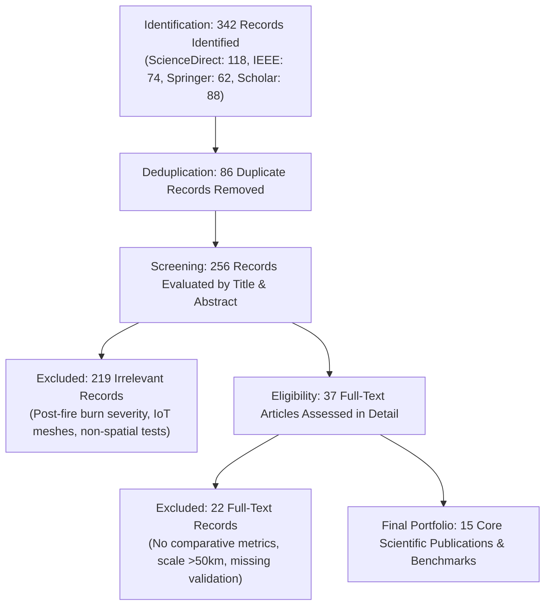

---\ntitle: "Scientific Search Strategy & Selection"\nproject: "TERRA-FIRE"\ntags:\n  - scientific-intelligence\n  - terra-fire\n---\n\n## 4. Scientific Search Strategy

To guarantee academic rigor and reproducibility, a structured search strategy was designed across primary multidisciplinary and specialized scientific databases.

### Table 4.1: Keyword Matrix
| Concept | Main Keyword | Synonyms | Related Terms & Technical Terminology | Acronyms | Equivalent Spanish Terms |
| :--- | :--- | :--- | :--- | :--- | :--- |
| **Problem Domain** | Wildfire | Forest fire, bushfire, vegetation fire | Wildland-urban interface (WUI), ignition hazard, burn severity, fire susceptibility | WF, FWI | Incendio forestal, fuego no controlado, régimen del fuego |
| **Vegetation Biophysics** | Fuel Moisture | Live fuel moisture content, foliar water content | Equivalent water thickness, canopy water stress, leaf dry matter content | LFMC, EWT | Contenido de humedad de combustible vivo, estrés hídrico foliar |
| **Atmospheric Dynamics** | Vapor Pressure Deficit | Atmospheric evaporative demand, dryness index | Relative humidity, dew point depression, saturation vapor pressure, adiabatic lapse | VPD, AED, RH | Déficit de presión de vapor, demanda evaporativa, gradiente adiabático |
| **Remote Sensing** | Multispectral Imagery | Earth observation, satellite telemetry | Surface reflectance, shortwave infrared, scene classification, synthetic aperture radar | EO, MSI, SWIR, SAR | Teledetección satelital, reflectancia espectral, radar de apertura sintética |
| **Machine Learning** | Gradient Boosting | Decision tree ensemble, supervised learning | Extreme gradient boosting, random forest, class imbalance, feature attribution, spatial leakage | GBDT, XGBoost, SHAP, AUC-ROC | Aprendizaje automático por gradiente, árboles de decisión, explicabilidad algorítmica |
| **Edge Computing** | Offline GIS | Edge cartography, client-side caching | Vector tiles, service workers, progressive web apps, disconnected spatial databases | MVT, PWA, WASM | Cartografía táctica desconectada, teselas vectoriales, aplicaciones progresivas |

### 4.2. Scientific Search Strings
Three Boolean search strings were constructed with progressive specificity:

- **String A (Broad - Conceptual Foundation):**
  ```text
  ("wildfire" OR "forest fire") 
  AND ("remote sensing" OR "satellite") 
  AND ("machine learning" OR "predictive model*")
  ```
- **String B (Intermediate - Biophysical & Algorithmic Convergence):**
  ```text
  ("wildfire hazard" OR "fire danger" OR "ignition probability") 
  AND ("live fuel moisture content" OR "vapor pressure deficit" OR "VPD" OR "NDMI") 
  AND ("Sentinel-2" OR "ERA5" OR "Copernicus") 
  AND ("gradient boosting" OR "XGBoost" OR "Random Forest")
  ```
- **String C (Highly Targeted - Implementation, Resolution & Edge Disconnection):**
  ```text
  ("wildfire prediction" OR "pre-ignition forecasting") 
  AND ("Sentinel-2" AND "ERA5-Land") 
  AND ("high-resolution" OR "10m" OR "downscaling") 
  AND ("XGBoost" OR "SHAP") 
  AND ("offline" OR "edge computing" OR "vector tiles" OR "mobile")
  ```

### Table 4.3: Scientific Source Selection Table
| Database / Repository | Operational Purpose | Primary Search String Applied | Justification & Institutional Relevance |
| :--- | :--- | :--- | :--- |
| **ScienceDirect (Elsevier)** | Peer-reviewed environmental and remote sensing literature. | String B | Prime index for *Remote Sensing of Environment*, containing foundational LFMC and biophysical modeling studies. |
| **IEEE Xplore Digital Library** | Geoscience instrumentation, remote sensing algorithms, and edge computing. | String C | Core repository for *IEEE Transactions on Geoscience and Remote Sensing*, covering high-resolution satellite pipelines. |
| **SpringerLink** | Forestry science, ecological informatics, and computational intelligence. | String B | Publishes *Current Forestry Reports* and specialized treatises on machine learning applications in wildfire science. |
| **Google Scholar** | Broad academic discovery, citation cross-referencing, and preprints. | Strings A, B, C | Comprehensive tracking of state-of-the-art citation lineages across interdisciplinary environmental and AI fields. |
| **ACM Digital Library** | Machine learning architectures, scalable systems, and web standards. | String C | Foundational source for extreme gradient boosting (XGBoost) systems, tree explainability, and mobile edge computing. |
| **Copernicus Open Access / ECMWF CDS** | Technical specifications and validation reports for planetary sensor products. | Targeted Technical Queries | Official technical documentation for Sentinel-2 MSI level-2A products and ERA5-Land reanalysis calibration. |

---

## 5. Scientific Publication Selection

### 5.1. Eligibility Criteria Matrix
Rigorous inclusion and exclusion criteria were established prior to document screening to eliminate commercial whitepapers, opinion pieces, and technologically unfeasible systems.

### Table 5.1: Eligibility Criteria Matrix
| Criterion Type | Criterion Description | Methodological Justification |
| :--- | :--- | :--- |
| **Inclusion (IC1)** | Peer-reviewed journal articles, seminal conference proceedings, or authoritative institutional technical reports. | Guarantees methodological rigor, reproducible experimental benchmarks, and verified findings. |
| **Inclusion (IC2)** | Direct focus on wildfire susceptibility, pre-ignition danger, fuel moisture content, or fire behavior prediction. | Aligns directly with the core problem domain of the TERRA-FIRE predictive engine. |
| **Inclusion (IC3)** | Application of satellite remote sensing (optical or radar) or planetary meteorological reanalysis data. | Validates the feasibility of our Zero CapEx planetary data ingestion pipeline. |
| **Inclusion (IC4)** | Utilization of supervised machine learning algorithms, ensemble trees, or explicit biophysical downscaling models. | Provides comparative mathematical evidence for our algorithmic and feature engineering architecture. |
| **Inclusion (IC5)** | Publication date between 2012 and 2026 (with exceptions for foundational seminal works establishing standard indices). | Ensures contemporary state-of-the-art technological relevance and sensor fidelity. |
| **Exclusion (EC1)** | Studies exclusively evaluating post-fire burn severity, post-fire soil erosion, or reforestation monitoring. | Irrelevant to pre-ignition risk forecasting (48–72h lead time). |
| **Exclusion (EC2)** | Systems relying entirely on high-density physical ground sensor meshes (IoT/LoRaWAN) in forests. | Unfeasible in Mexican mountainous reserves due to extreme CapEx, theft, vandalism, and battery maintenance failure. |
| **Exclusion (EC3)** | Opaque, proprietary non-peer-reviewed vendor brochures lacking open mathematical formulations. | Cannot be validated or reproduced within an academic engineering framework. |
| **Exclusion (EC4)** | Non-georeferenced laboratory combustion chamber simulations lacking landscape-scale spatial transferability. | Fails to capture real-world topographic, atmospheric, and vegetative heterogeneity. |

### 5.2. Publication Screening Process (PRISMA Workflow)
The literature selection followed a four-stage systematic screening workflow:
1. **Identification:** 342 candidate records retrieved across ScienceDirect ($n = 118$), IEEE Xplore ($n = 74$), SpringerLink ($n = 62$), Google Scholar ($n = 88$).
2. **Deduplication:** 86 duplicate entries were identified and removed, leaving 256 unique records.
3. **Screening (Title & Abstract):** 256 titles and abstracts were screened against IC1–IC5 and EC1–EC4. 219 articles were excluded (primarily post-fire mapping, IoT-only deployments, or non-spatial laboratory tests).
4. **Eligibility (Full-Text Evaluation):** 37 full-text articles were thoroughly evaluated. 22 were excluded due to lack of comparative metrics, coarse spatial scale (>50 km), or absence of pre-ignition predictive capacity.
5. **Final Portfolio:** **15 high-impact scientific publications and institutional benchmarks** were selected for in-depth documentary extraction.



### Table 5.2: Scientific Publication Portfolio
| ID | Authors & Year | Publication Title | Journal / Source | Scientific Typology | Core Thematic Contribution |
| :---: | :--- | :--- | :--- | :--- | :--- |
| **S01** | Chuvieco et al. (2020) | Satellite remote sensing contributions to wildland fire science and management | *Current Forestry Reports* | Review / Synthesis | Establishes the planetary satellite framework for fire danger, separating pre-fire fuel status from post-fire effects. |
| **S02** | Jain et al. (2020) | A review of machine learning applications in wildfire science and management | *Environmental Reviews* | Review / Benchmark | Comprehensive benchmark of ML algorithms; validates GBDT superiority over traditional fire weather indices. |
| **S03** | Yebra et al. (2013) | A global review of remote sensing of live fuel moisture content for fire danger assessment | *Remote Sensing of Environment* | Global Review | Proves that SWIR-based indices (NDMI, MSI) reflect foliar water content far more accurately than chlorophyll indices (NDVI). |
| **S04** | Seager et al. (2015) | Climatology, variability, and trends in the U.S. vapor pressure deficit, an important fire-related metric | *Journal of Applied Meteorology and Climatology* | Empirical / Climate | Demonstrates that Vapor Pressure Deficit (VPD) is the governing physical driver of atmospheric drying and fire size. |
| **S05** | Chen & Guestrin (2016) | XGBoost: A scalable tree boosting system | *ACM SIGKDD International Conference* | Computational System | Establishes the mathematical formulation of extreme gradient boosted decision trees for tabular geospatial inference. |
| **S06** | Lundberg & Lee (2017) | A unified approach to interpreting model predictions | *Advances in Neural Information Processing Systems (NeurIPS)* | Algorithmic / XAI | Formulates TreeSHAP, providing game-theoretic local feature attributions necessary for technical dispatch trust. |
| **S07** | Roberts et al. (2017) | Cross-validation strategies for data with spatial, temporal, or phylogenetic dependence | *Ecography* | Methodological / Spatial Stats | Proves that random cross-validation overestimates spatial accuracy; mandates spatial-block cross-validation. |
| **S08** | Muñoz-Sabater et al. (2021) | ERA5-Land: A state-of-the-art global reanalysis dataset for land applications | *Earth System Science Data* | Dataset / Reanalysis | Validates hourly planetary reanalysis variables (dewpoint, 2m temp, surface pressure, soil moisture) at 9 km grid. |
| **S09** | Drusch et al. (2012) | Sentinel-2: ESA's optical high-resolution mission for GMES operational services | *Remote Sensing of Environment* | Sensor / Mission | Details the spectral band configuration (B8 NIR, B11/B12 SWIR) enabling 10–20m vegetative water stress estimation. |
| **S10** | Abatzoglou & Williams (2016) | Impact of anthropogenic climate change on wildfire across western US forests | *Proceedings of the National Academy of Sciences (PNAS)* | Empirical Climate Modeling | Establishes fuel aridity metrics and proves non-linear fire hazard escalation when VPD thresholds are crossed. |
| **S11** | Barmpoutis et al. (2020) | A review on early forest fire detection systems using optical remote sensing, drones and machine learning | *Sensors* | Review / Surveillance | Benchmarks optical and thermal sensors; identifies latency bottlenecks in satellite-based active fire alerting. |
| **S12** | Coogan et al. (2019) | Scientists' warning on extreme wildfire risks to human life, property, and ecosystems | *FACETS* | Global Synthesis | Highlights the socio-ecological necessity of shifting funding from reactive suppression to anticipatory prevention. |
| **S13** | Giglio et al. (2016) | The collection 6 MODIS active fire detection algorithm and fire products | *Remote Sensing of Environment* | Algorithm / Validation | Establishes the 375m/1km active thermal detection baseline and documents the inherent 3–12h observation latency. |
| **S14** | Van Wagner (1987) | Development and structure of the Canadian Forest Fire Weather Index System | *Canadian Forestry Service Tech Report* | Seminal Framework | Establishes the mathematical basis of the Canadian FWI system adapted by Mexico's CONAFOR SPPIF. |
| **S15** | CONAFOR (2024) | Reporte del Sistema de Predicción de Peligro de Incendios Forestales (SPPIF) | *CONAFOR Institutional Report* | Institutional Technical Report | Documents the current operational reality in Mexico, highlighting the ~10km spatial resolution limitation and lack of ML. |

---\n