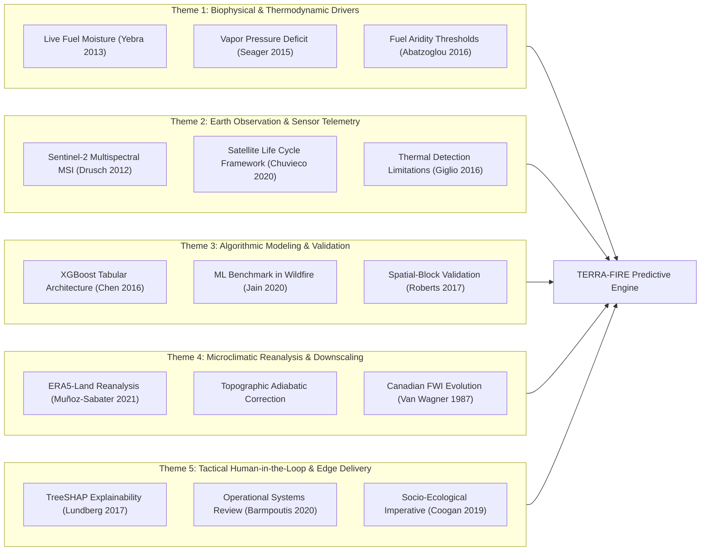

---\ntitle: "Thematic Literature Map & Evolution"\nproject: "TERRA-FIRE"\ntags:\n  - scientific-intelligence\n  - terra-fire\n---\n\n## 9. Thematic Literature Map

The reviewed scientific literature was organized into five cohesive thematic research pillars directly aligned with TERRA-FIRE's architectural layers.

### Table 9.1: Thematic Literature Classification Matrix
| Research Theme | Primary Publications | Key Scientific Principles Established | Architectural Contribution to TERRA-FIRE |
| :--- | :--- | :--- | :--- |
| **Theme 1: Biophysical & Thermodynamic Drivers** | Yebra et al. (2013), Seager et al. (2015), Abatzoglou & Williams (2016) | LFMC and atmospheric VPD govern ignition physics; vegetative water stress can be monitored via SWIR absorption. | Dictates the mathematical feature engineering formulas: NDMI, SAVI, and hourly VPD calculation. |
| **Theme 2: Earth Observation & Planetary Telemetry** | Drusch et al. (2012), Chuvieco et al. (2020), Giglio et al. (2016) | Sentinel-2 provides 10–20m multispectral resolution; active thermal sensors (VIIRS) are inherently post-ignition. | Validates using Copernicus Sentinel-2 L2A for pre-ignition features and VIIRS for historical training labels. |
| **Theme 3: Algorithmic Modeling & Spatial Validation** | Chen & Guestrin (2016), Jain et al. (2020), Roberts et al. (2017) | Gradient boosting excels on heterogeneous tabular spatial data; spatial-block CV is mandatory to prevent inflated accuracy. | Establishes the XGBoost training pipeline, Parquet feature store, and spatial k-fold evaluation protocol. |
| **Theme 4: Microclimatic Reanalysis & Downscaling** | Van Wagner (1987), Muñoz-Sabater et al. (2021), CONAFOR (2024) | Coarse 9 km reanalyses (ERA5-Land) must be topographically corrected via DEMs to capture canyon microclimates. | Defines the adiabatic lapse rate temperature adjustment and hourly vapor pressure downscaling routines. |
| **Theme 5: Tactical Edge Delivery & Explainability** | Lundberg & Lee (2017), Coogan et al. (2019), Barmpoutis et al. (2020) | Operational trust requires local feature attribution (SHAP); solutions must overcome rural connectivity divides. | Mandates the TreeSHAP local explanation module and the offline-first vector tile PWA delivery architecture. |

---

## 10. Scientific Evolution Timeline

The technological and scientific trajectory of wildfire prediction has evolved over five distinct eras across the past five decades:

```mermaid
flowchart LR
    subgraph ERA1["1970–1989: Empirical Fire Modeling"]
        direction TB
        E1_1["Rothermel Surface Spread Equations (1972)"]
        E1_2["Canadian FWI System (Van Wagner, 1987)"]
        E1_3["Point Weather Station Dependence"]
    end

    subgraph ERA2["1990–2009: Coarse Earth Observation"]
        direction TB
        E2_1["NOAA-AVHRR 1km Vegetation Monitoring"]
        E2_2["NASA Terra/Aqua MODIS Launch (2000)"]
        E2_3["Early GIS Raster Overlay Analysis"]
    end

    subgraph ERA3["2010–2017: Active Thermal Detection"]
        direction TB
        E3_1["NASA VIIRS 375m Active Fire Detection"]
        E3_2["NASA FIRMS Reactive Hotspot Alerts"]
        E3_3["Statistical Logistic Regression Models"]
    end

    subgraph ERA4["2018–2022: Planetary ML & Big Data"]
        direction TB
        E4_1["ESA Sentinel-2 Multi-Spectral (10m)"]
        E4_2["ECMWF ERA5-Land Surface Reanalysis"]
        E4_3["GBDT & Random Forest Benchmarks (Jain 2020)"]
    end

    subgraph ERA5["2023–2026: Anticipatory Edge Intelligence"]
        direction TB
        E5_1["Cloud-Native STAC Planetary Catalogs"]
        E5_2["TreeSHAP Game-Theoretic Explainability"]
        E5_3["TERRA-FIRE: 48-72h 10m Offline Tactical PWA"]
    end

    ERA1 --> ERA2 --> ERA3 --> ERA4 --> ERA5
```

### 10.1. Analytical Commentary on Field Maturity
- **Phase 1 (1970–1989): Empirical & Weather-Station Dependence.** Dominated by empirical fire behavior equations (Rothermel) and meteorological index calculation (Canadian FWI). Highly constrained by physical station density and unable to capture spatial heterogeneity.
- **Phase 2 (1990–2009): Macro-Scale Earth Observation.** Introduction of coarse polar-orbiting satellites (AVHRR, MODIS). Enabled continental-scale vegetation greenness tracking (NDVI at 1 km), but spatial and temporal granularity remained inadequate for local farm burn management.
- **Phase 3 (2010–2017): Contextual Active Fire Detection.** Maturation of thermal anomaly detection algorithms (VIIRS 375m). Revolutionized global situational awareness, but solidified an institutional reliance on *reactive suppression* (alerting only after flames were established).
- **Phase 4 (2018–2022): Planetary Cloud Computing & Machine Learning.** Release of open Copernicus Sentinel constellations (10–20m) and ECMWF ERA5-Land reanalysis. Transition from linear statistical models to non-linear tree ensembles (XGBoost, Random Forest), demonstrating significant predictive leaps in research papers.
- **Phase 5 (2023–2026): Anticipatory Predictive Intelligence & Tactical Edge Delivery (TERRA-FIRE Era).** The contemporary frontier bridges the gap between planetary cloud servers and disconnected frontline practitioners. By coupling multi-spectral Live Fuel Moisture proxies with downscaled thermodynamic evaporative demand, explainable AI (XAI), and offline vector tiling (MVT), scientific knowledge transitions from retrospective academic analysis to **anticipatory field operations**.

---

## 11. State-of-the-Art Synthesis

The synthesis of contemporary scientific literature establishes that predicting wildfire susceptibility 48 to 72 hours prior to ignition is **theoretically and computationally viable today** without physical in-situ sensor networks:

1. **The Biophysical State of Knowledge:** Wildfire ignition in non-arid ecosystems is primarily constrained by fuel moisture rather than fuel quantity. When Live Fuel Moisture Content (LFMC) falls below the critical physiological threshold of **80% to 100% dry weight**, leaves can no longer absorb heat through water vaporization, leading to rapid pyrolytic gas emission. This vegetative water depletion is directly observable from orbit using the Shortwave Infrared (SWIR) bands of Sentinel-2 (specifically the Normalized Difference Moisture Index, NDMI: $\frac{\text{B8} - \text{B11}}{\text{B8} + \text{B11}}$), outperforming conventional greenness indices (NDVI) which remain deceptively elevated during early dehydration phases (Yebra et al., 2013).
2. **The Thermodynamic Trigger:** While fuel provides the combustible substrate, **Vapor Pressure Deficit (VPD)** acts as the dynamic thermodynamic pump. VPD measures the drying power of the atmosphere (the difference between saturation vapor pressure and actual vapor pressure: $e_s - e_a$). Surges in VPD above **2.0 kPa** rapidly extract moisture from fine dead fuels within hours, creating catastrophic ignition conditions (Seager et al., 2015). Integrating downscaled hourly VPD from ECMWF ERA5-Land provides the 48-to-72-hour forecasting horizon necessary to preempt agricultural burn escapes.
3. **The Algorithmic Consensus:** Multiple independent benchmarks (Jain et al., 2020) demonstrate that gradient-boosted decision trees (XGBoost) represent the most reliable predictive architecture for geospatial tabular hazard modeling. They achieve superior precision-recall area under the curve (PR-AUC) compared to deep learning networks, execute inference in milliseconds per county, and natively handle missing data (such as localized cloud masks).
4. **The Unresolved Operational Frontier:** Despite mature scientific models in academic publications, a severe **implementation chasm** persists. National agencies (such as CONAFOR in Mexico) remain tethered to coarse 10 km interpolations (SPPIF) or post-ignition thermal alerts (FIRMS). Furthermore, existing platforms assume high-speed internet connectivity. The true frontier of wildfire science lies in **operational packaging**: translating planetary Earth Observation into lightweight vector tiles that can be stored and queried locally on standard mobile devices carried by disconnected rural ejidatarios and municipal brigades.

---\n