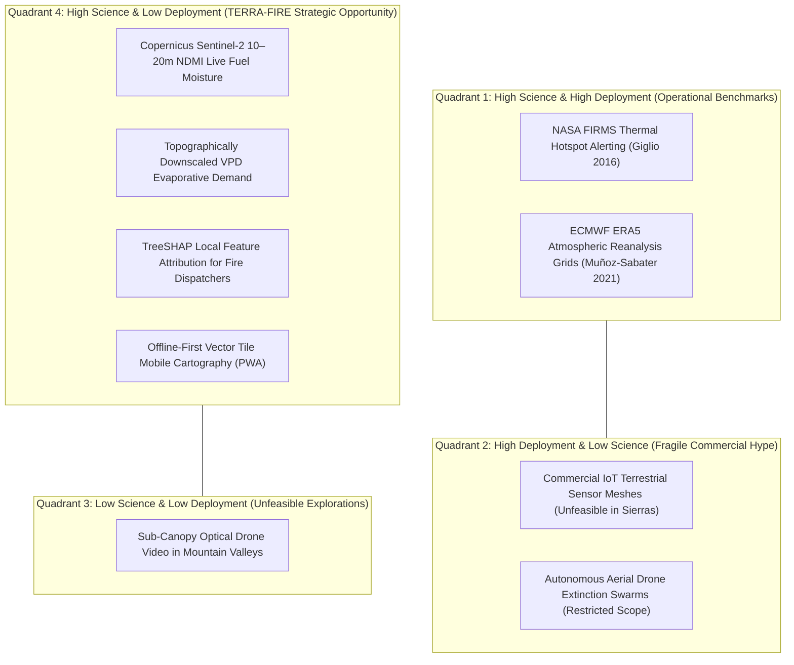

---\ntitle: "Science-Technology Connection & Gap Analysis"\nproject: "TERRA-FIRE"\ntags:\n  - scientific-intelligence\n  - terra-fire\n---\n\n## 12. Science-Technology Connection

To translate scientific principles into tangible engineering components, the mathematical and physical foundations identified in the literature were mapped directly to software and data technologies.

### Table 12.1: Science-Technology Connection Matrix
| Technology Component | Scientific Foundation & Principles | Real-World Application & Evidence | Technical Limitations & Constraints |
| :--- | :--- | :--- | :--- |
| **Copernicus Sentinel-2 Multi-Spectral Instrument (MSI)** | Radiative transfer theory; differential absorption of liquid water at $1.6\,\mu\text{m}$ (Band 11 SWIR) vs. structural reflectance at $0.84\,\mu\text{m}$ (Band 8 NIR). | Automated extraction of 10–20m NDMI, SAVI, and NBR raster mosaics via Microsoft Planetary Computer STAC API. | Optical obstruction by cloud decks; 5-day orbital revisit cycle (mitigated by temporal spline decay models). |
| **ECMWF ERA5-Land Global Atmospheric Reanalysis** | Hydrodynamic and thermodynamic boundary-layer equations; global numerical weather assimilation (IFS cy41r2). | Hourly extraction of 2m temperature, 2m dewpoint, surface pressure, and 10m wind velocity vectors ($u, v$). | Coarse spatial resolution ($0.1^\circ \approx 9\text{ km}$); requires adiabatic lapse rate downscaling for steep montane relief. |
| **XGBoost Decision Tree Framework** | Regularized empirical risk minimization, second-order Taylor expansion of the loss function, weighted quantile sketching (Chen & Guestrin, 2016). | Binary classification of daily 10–20m landscape voxels: $P(\text{Ignition within 48–72h})$. | Tabular format requires multi-band raster flattening and alignment; memory usage during large batch inference. |
| **TreeSHAP Explainable AI Engine** | Cooperative game theory; classic Shapley value formulation extended to conditional expectations in tree structures (Lundberg & Lee, 2017). | Generation of local top-3 risk attribution drivers per polygon (e.g., "High Slope + Critical VPD Surge + Severe NDMI Deficit"). | Increases inference pipeline time by ~15%; requires compact serialization of SHAP explanation vectors. |
| **Tippecanoe Vector Tile Compressor** | Douglas-Peucker line simplification, polygon clipping, and protobuf encoding (Mapbox Vector Tile Specification). | Compiling national risk polygons into lightweight binary vector tiles (`.pbf`) under 15 MB per municipality. | Loss of sub-meter geometric vertices during high-level zoom aggregation (acceptable for 10–20m hazard voxels). |
| **IndexedDB & SQLite/WASM Mobile Cache** | Client-side persistent relational storage within standard Web Worker runtimes (W3C Web Storage Standards). | Caching complete municipal vector tiles, offline base layers, and tactical risk attributes inside the smartphone browser. | Storage quotas enforced by mobile operating systems (~50MB to 500MB depending on device available storage). |

---

## 13. Technology Surveillance

A rigorous technological surveillance was conducted to benchmark existing operational platforms, research prototypes, and industrial tools against TERRA-FIRE's target capabilities.

### Table 13.1: Technology Surveillance Portfolio
| Platform / Project | Typology & Provenance | Operational Maturity Level | Core Architectural Capabilities | Scientific Alignment & Implementation Lessons for TERRA-FIRE |
| :--- | :--- | :--- | :--- | :--- |
| **CONAFOR SPPIF** *(Sistema de Predicción de Peligro)* | National Government Platform (Mexico) | **TRL 9 (Operational)** | Daily fire danger index generation based on the Canadian FWI system; national spatial coverage. | **Negative Lesson:** Spatial resolution (~10 km) is too coarse for parcel-level burn decisions; ignores microtopography and satellite live fuel moisture. |
| **NASA FIRMS** *(Fire Information for Resource Management System)* | Global Space Agency Portal (USA) | **TRL 9 (Operational)** | Near-real-time global active thermal detection using MODIS (1km) and VIIRS (375m); email/SMS alerts. | **Operational Benchmark:** Excellent for ground-truth historical training labels, but fundamentally reactive (3–12h latency after ignition). |
| **Technosylva Wildfire Analyst** | Commercial Industrial Platform (USA / Spain) | **TRL 9 (Commercial)** | Cloud-based physics-driven fire behavior spread simulations for large electric utility companies (PG&E). | **Economic Lesson:** Highly sophisticated but relies on proprietary closed software costing millions in licensing; unfeasible for low-income Mexican ejidos. |
| **Pyregence Consortium** | Academic / Open-Source Consortium (California) | **TRL 7 (Prototype / Pilot)** | High-resolution operational fire danger forecasts using WRF weather modeling and open-source Python stacks. | **Architectural Lesson:** Proves viability of open cloud architectures; however, requires massive server infrastructure and assumes constant internet. |
| **Google FireSat / Research Wildfire AI** | Multinational Tech Pilot (Global) | **TRL 6 (Demonstration)** | Custom high-cadence infrared satellite constellation and AI boundary tracking for active wildfires. | **Surveillance Insight:** Focuses primarily on active fire tracking from space rather than pre-ignition agricultural burn management on the ground. |
| **MapLibre GL JS & Tippecanoe** | Open-Source Geospatial Engine (OSGeo) | **TRL 9 (Mature Open-Source)** | GPU-accelerated client-side vector tile rendering via WebGL; extreme tile compression (`.pbf`). | **Core Technology Adopted:** Confirms that MapLibre GL is the gold standard for rendering fluid 60 FPS offline maps inside mobile browser runtimes. |

---

## 14. Science-Technology Gap Analysis

A critical evaluation comparing scientific maturity with technological deployment reveals four structural gap archetypes:

### Table 14.1: Science-Technology Gap Matrix
| Domain / Sub-System | Scientific Maturity | Technological Maturity | Nature of the Gap | Strategic Opportunity for TERRA-FIRE |
| :--- | :--- | :--- | :--- | :--- |
| **Live Fuel Moisture Content (LFMC) via Sentinel-2** | **High:** Multiple peer-reviewed radiative transfer and empirical studies validate SWIR (B11/B12) accuracy ($R^2 > 0.75$). | **Low:** Operational forestry agencies in Latin America still rely on static vegetation lookup tables or 1 km NDVI. | **Strong Science Lacks Deployment:** The mathematical formulations are mature, but no public agency has integrated automated 10m pipelines into operational dispatch. | Direct integration of automated Sentinel-2 L2A ingestion to calculate 10–20m NDMI across Mexican priority ejidos. |
| **Thermodynamic Evaporative Demand (VPD) Downscaling** | **High:** Atmospheric physics firmly establishes VPD as the prime driver of fine fuel flammability and spread. | **Low:** Government fire danger products rely on noon ambient temperature and relative humidity from distant weather stations. | **Strong Science Lacks Deployment:** Regional reanalysis models (ERA5-Land) exist globally, but downscaled micro-topographic VPD is rarely served to field units. | Implement adiabatic lapse rate elevation adjustments on ERA5-Land to deliver localized VPD forecasts at canyon scale. |
| **Terrestrial IoT Forest Sensor Arrays** | **Low:** Lacks peer-reviewed evidence proving cost-effective spatio-temporal coverage across vast rugged biomes. | **Moderate / High:** Commercial vendors promote LoRaWAN/NB-IoT gas and temperature sensor hardware. | **Technology Lacks Scientific / Economic Validation:** Hardware fails rapidly in real montane conditions due to tree canopy attenuation, battery failure, and vandalism. | Eliminate physical in-situ sensors entirely; base the architecture on zero-CapEx satellite and reanalysis telemetry. |
| **Tactical Offline Mobile GIS for Rural Brigades** | **High:** Web standards (Service Workers, IndexedDB, WASM, MVT) are fully established in mainstream computer science. | **Very Low:** Operational wildfire software predominantly consists of desktop GIS (QGIS, ArcGIS) or web portals requiring high-bandwidth 4G/5G. | **Dual Application Gap in Disaster Management:** Advanced web GIS standards have not been applied to frontline wildfire management in disconnected rural regions. | Pioneer the deployment of an offline-first PWA caching binary vector tiles (`.pbf`) to provide tactical navigation without internet. |

---

## 15. Research Limitations

A synthesis of recurring limitations documented across the 15 reviewed publications identifies six structural categories:

### Table 15.1: Research Limitation Matrix
| Category | Documented Limitation | Technical Rationale & Impact | Mitigation Strategy in TERRA-FIRE |
| :--- | :--- | :--- | :--- |
| **1. Data Limitations** | Optical Cloud Deck Obstruction | Heavy cloud cover during seasonal transition periods impedes Sentinel-2 surface reflectance, creating temporal data gaps. | Implement temporal spline interpolation and exponential moisture decay functions driven by continuous non-cloud-dependent ERA5 VPD. |
| **2. Methodological Limitations** | Extreme Spatial Class Imbalance | Wildfire ignitions represent less than 0.05% of all landscape grid cells on any given day, causing models to predict zero fire everywhere. | Calibrate XGBoost using specialized loss weighting (`scale_pos_weight`), focal loss formulations, and PR-AUC optimization instead of accuracy. |
| **3. Spatial Autocorrelation Bias** | Spatiotemporal Data Leakage | Geographic proximity between training and validation pixels leads to artificially inflated accuracy metrics when using random k-fold CV. | Enforce rigid **Spatial-Block Cross-Validation** (Roberts et al., 2017), partitioning training and evaluation folds by distinct mountain sub-basins. |
| **4. Technological Limitations** | Planetary Raster Storage & Bandwidth | Ingesting and processing uncompressed Sentinel-2 multi-spectral scenes nationally requires petabyte-scale storage and immense bandwidth. | Adopt Cloud-Optimized GeoTIFFs (COGs) and SpatioTemporal Asset Catalogs (STAC) to query only necessary sub-region bounding boxes. |
| **5. Contextual & Population Limitations** | The Frontline Telecommunications Divide | Mountainous conservation areas and rural ejidos in Mexico lack 3G/4G/5G mobile connectivity, rendering cloud APIs inaccessible in the field. | Design the client interface as an **Offline-First PWA**, downloading municipal vector tiles (`.pbf`) in town before field deployment. |
| **6. Evaluation Limitations** | Inadequacy of ROC-AUC for Hazard Decisions | Standard ROC-AUC overvalues correct classification of vast unburned background areas; high ROC-AUC can mask abysmal positive predictive value. | Base model selection strictly on **Precision-Recall AUC (PR-AUC)**, F-beta ($\beta = 2$ to prioritize recall), and Brier Reliability Calibration scores. |

---

## 16. Research Gaps

By triangulating documented limitations against operational real-world requirements, four authentic research gaps were identified:

### Table 16.1: Research Gap Matrix
| Gap Identifier | Description of the Research Gap | Supporting Evidence from Literature | Scientific & Practical Importance | Potential Innovation Opportunity for TERRA-FIRE |
| :--- | :--- | :--- | :--- | :--- |
| **GAP 1: Hyperlocal Pre-Ignition Coupling (10m)** | Absence of operational models coupling 10–20m multispectral vegetative water stress (Sentinel-2 NDMI) with downscaled hourly atmospheric evaporative demand (ERA5 VPD) for 48–72h pre-ignition forecasting. | Chuvieco et al. (2020), Yebra et al. (2013), Seager et al. (2015), CONAFOR (2024). | Existing systems operate either at coarse regional scales (~10 km) or detect fire strictly after ignition. Pre-ignition at 10m enables parcel-level prevention. | Build the first open spatiotemporal matrix coupling 10m Sentinel-2 SWIR moisture with downscaled ERA5-Land VPD across Mexican forests. |
| **GAP 2: Spatial Block Validation under Extreme Imbalance** | Lack of rigorously benchmarked GBDT architectures trained on extreme geospatial class imbalance (<0.05% fire) under strict spatial-block cross-validation to prevent spatial autocorrelation leakage. | Jain et al. (2020), Roberts et al. (2017), Chen & Guestrin (2016). | Most published models report inflated performance metrics from random k-fold splits, failing catastrophically when deployed to adjacent mountain ranges. | Formulate an open benchmark comparing cost-sensitive XGBoost and spatial block splitting across Mexican biomes. |
| **GAP 3: Explainable Risk Attribution (XAI) for Frontline Decision-Makers** | Absence of operational wildfire platforms integrating game-theoretic feature attribution (TreeSHAP) to explain the local physical drivers of high-risk alerts to non-academic dispatchers. | Lundberg & Lee (2017), Coogan et al. (2019). | Forestry dispatchers reject "black-box" machine learning predictions; they require transparent justification (e.g., slope vs. wind vs. fuel drought) to deploy resources. | Develop a real-time TreeSHAP serialization pipeline that outputs the top-3 physical risk drivers alongside every predicted hazard polygon. |
| **GAP 4: Disconnected Edge Cartography for Rural Ejidos** | Total absence of predictive wildfire early-warning systems engineered with an offline-first, zero-bandwidth PWA architecture for low-end mobile devices in rural cellular dead zones. | Barmpoutis et al. (2020), Coogan et al. (2019), CONAFOR (2024). | High-tech predictive models are useless if they cannot reach the rural ejidatarios conducting the agricultural burns in mountainous areas without cell service. | Engineer an automated vector tiling pipeline (Tippecanoe + MapLibre GL) caching municipal risk tiles in IndexedDB for full offline navigation. |

---

## 17. Research Opportunity Prioritization

To determine where the project should concentrate its development efforts, the four identified research gaps were evaluated across five multi-criteria dimensions (scored on a 1 to 5 scale):

### Table 17.1: Research Opportunity Prioritization Matrix
| Evaluation Dimension (Weight) | Gap 1: Hyperlocal Pre-Ignition (10m) | Gap 2: Spatial Block Validation | Gap 3: Explainable XAI (TreeSHAP) | Gap 4: Disconnected Edge Cartography |
| :--- | :---: | :---: | :---: | :---: |
| **Scientific Relevance (25%)** | 4.8 | 4.6 | 4.2 | 3.8 |
| **Technological Feasibility (20%)** | 4.2 | 4.5 | 4.0 | 4.6 |
| **Expected Societal & Ecological Impact (25%)** | 4.9 | 4.0 | 4.3 | 4.8 |
| **National Strategic Alignment [SECIHTI Axis 4] (15%)** | 4.8 | 4.2 | 4.0 | 4.7 |
| **Project Team Feasibility [UTR IT Engineering] (15%)** | 4.4 | 4.5 | 4.2 | 4.7 |
| **Weighted Composite Score (100%)** | **4.64** | **4.34** | **4.16** | **4.49** |
| **Strategic Priority Ranking** | **Priority 1 (Core Engine)** | **Priority 3 (Validation)** | **Priority 4 (Feature)** | **Priority 2 (Delivery)** |

### 17.2. Prioritization Justification
- **Top Priority (Gap 1 - Composite Score: 4.64):** The integration of 10–20m multispectral vegetative water stress with downscaled thermodynamic VPD constitutes the **essential scientific core of TERRA-FIRE**. Without this predictive engine, no anticipatory warning is possible. It directly addresses the fatal 3–12 hour latency of NASA FIRMS and the coarse 10 km interpolation of CONAFOR SPPIF.
- **Immediate Operational Enabler (Gap 2 & Gap 4 - Scores: 4.49 and 4.34):** Gap 4 represents our primary disruptive technological differentiator. Delivering the predictive engine via an offline-first PWA ensures that scientific intelligence transcends academic theory and directly empowers disconnected rural communities in the Sierra Madre. Gap 2 guarantees the mathematical validity and spatial generalizability of the resulting model.

---\n