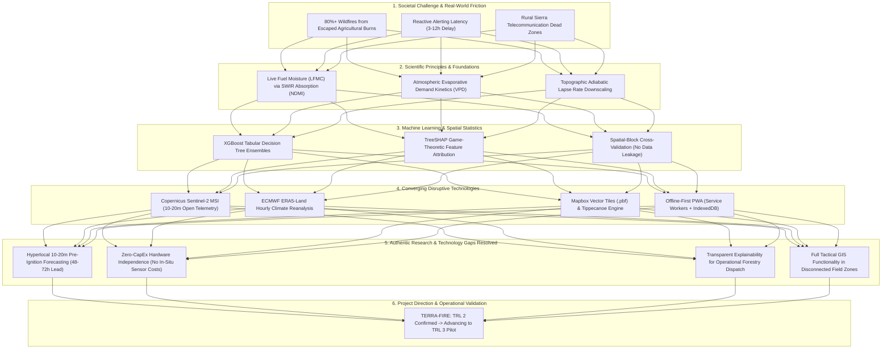

---\ntitle: "Scientific Foundation & Hypothesis"\nproject: "TERRA-FIRE"\ntags:\n  - scientific-intelligence\n  - terra-fire\n---\n\n## 18. Scientific Foundation and Preliminary Hypothesis

### 18.1. Scientific Principles Supporting TERRA-FIRE
The conceptual architecture of TERRA-FIRE is grounded in four rigorously validated scientific principles:
1. **The Principle of Foliar Water Absorption (Radiative Transfer):** Liquid water in plant leaves exhibits strong, selective absorption of electromagnetic radiation at shortwave infrared wavelengths ($1.55 - 1.75\,\mu\text{m}$, Sentinel-2 Band 11), while cellular mesophyll structure reflects radiation at near-infrared wavelengths ($0.84\,\mu\text{m}$, Sentinel-2 Band 8). The Normalized Difference Moisture Index (NDMI) provides a direct, monotonic proxy for Live Fuel Moisture Content (LFMC), decreasing predictably as canopy water stress intensifies (Yebra et al., 2013; Drusch et al., 2012).
2. **The Thermodynamic Law of Evaporative Demand:** Fine dead fuels (cured grasses, leaf litter, pine needles) are hygroscopic and exchange moisture with the atmosphere to achieve equilibrium moisture content. The rate of desiccation is governed not by temperature alone, but by **Vapor Pressure Deficit (VPD)**, calculated from saturated vapor pressure ($e_s$) and actual vapor pressure ($e_a$):
   $$e_s(T) = 0.61078 \exp\left(\frac{17.27 \cdot T}{T + 237.3}\right)$$
   $$\text{VPD} = e_s(T) \cdot \left(1 - \frac{\text{RH}}{100}\right)$$
   Surges in VPD above $2.0\,\text{kPa}$ induce rapid fuel desiccation, dramatically elevating ignition susceptibility (Seager et al., 2015).
3. **The Principle of Topographic Orographic Modification:** In complex montane terrain, surface air temperature decreases with elevation according to the environmental adiabatic lapse rate ($\Gamma \approx 0.0065^\circ\text{C}/\text{m}$). Adjusting coarse reanalysis temperature grids using high-resolution Digital Elevation Models (Copernicus GLO-30 DEM) resolves microclimatic temperature and VPD variations between sheltered valley floors and exposed ridges (Muñoz-Sabater et al., 2021).
4. **The Principle of Non-Linear Tree Boosting & Additive Feature Attribution:** Wildfire ignition probability is a non-linear, non-additive function of biophysical fuel, atmospheric dryness, and topography. Gradient-boosted decision trees optimize regularized objective functions across sparse tabular inputs, and TreeSHAP decomposes predictions into exact additive Shapley values:
   $$f(x) = \phi_0 + \sum_{i=1}^M \phi_i(x)$$
   enabling transparent operational explanation of every prediction (Chen & Guestrin, 2016; Lundberg & Lee, 2017).

### 18.2. Formulation of the Preliminary Research Hypothesis

> [!important] Formal Research Hypothesis
> **Hypothesis $H_1$:**  
> *"The integration of 10–20 meter multi-spectral Live Fuel Moisture proxies (Sentinel-2 NDMI) with topographically downscaled hourly Vapor Pressure Deficit (ERA5-Land VPD) and terrain morphometry within an extreme gradient-boosted decision tree architecture (XGBoost) will predict spatial wildfire ignition occurrences with a lead time of 48 to 72 hours, achieving a Precision-Recall Area Under the Curve (PR-AUC) $\ge 0.45$ under rigid spatial-block cross-validation, demonstrating statistically significant predictive superiority ($p < 0.01$) over the conventional Canadian Forest Fire Weather Index (FWI) spatial interpolation currently utilized by CONAFOR."*

### 18.3. Variables and Operational Definitions
- **Independent Variables ($X$):**
  1. *Vegetative Fuel Moisture Index ($X_1$):* Sentinel-2 Level-2A NDMI ($\frac{\text{B8} - \text{B11}}{\text{B8} + \text{B11}}$), normalized between $-1.0$ and $+1.0$.
  2. *Atmospheric Evaporative Demand ($X_2$):* Downscaled hourly VPD ($\text{kPa}$) derived from ERA5-Land $2\text{m}$ temperature and dewpoint, corrected via Copernicus GLO-30 DEM.
  3. *Topographic Morphometry ($X_3$):* Slope inclination (degrees), aspect solar radiation index, and topographic position index derived from DEM.
  4. *Atmospheric Wind Vector ($X_4$):* Downscaled wind velocity ($\text{m/s}$) and wind direction vectors ($u, v$).
- **Dependent Variable ($Y$):**
  - Binary wildfire ignition event ($Y \in \{0, 1\}$) within a given $20\times20\,\text{m}$ voxel occurring within a $48\text{ to }72\text{-hour}$ forward window, ground-truthed against NASA FIRMS VIIRS 375m active fire detections with nominal confidence $> 50\%$.

---

## 19. Updated TRL 1-2 Assessment

Based on the synthesis of scientific evidence, technology surveillance, and system architecture formulation, the technological readiness of TERRA-FIRE is evaluated.

### Table 19.1: TRL 1 vs. TRL 2 Comparative Evidence Matrix
| Assessment Dimension | TRL 1 Requirements (Basic Principles Observed) | TRL 2 Requirements (Technology Concept Formulated) | Observed Status in TERRA-FIRE | Verified Level |
| :--- | :--- | :--- | :--- | :---: |
| **Scientific Principles** | Mathematical formulation of vegetation moisture absorption and atmospheric thermodynamics published in literature. | Principles translated into a practical, multi-variable engineering concept for hazard forecasting. | Validated mathematical formulas for NDMI, SAVI, adiabatic downscaling, and VPD calculation compiled into tabular schema. | **TRL 2 Achieved** |
| **System Architecture** | Conceptual recognition of satellite utility. | Complete end-to-end pipeline designed, specifying data flows from STAC APIs to client rendering. | Detailed pipeline designed: Cloud Ingest $\to$ Downscaling $\to$ Parquet Store $\to$ XGBoost $\to$ Tippecanoe $\to$ Offline PWA. | **TRL 2 Achieved** |
| **Data Specification** | Identification of potential data providers. | Comprehensive catalog of satellite APIs, update cadences, spatial resolutions, and Parquet data schemas defined. | Complete specification of Sentinel-2 L2A, ERA5-Land, DEM GLO-30, and FIRMS VIIRS in a unified $20\times20\text{m}$ feature matrix. | **TRL 2 Achieved** |
| **Algorithmic Strategy** | Awareness of machine learning classification. | Specific algorithmic family selected (XGBoost), loss function identified, and evaluation protocols defined. | Algorithmic selection justified over deep learning; scale-pos-weight and spatial-block cross-validation protocols specified. | **TRL 2 Achieved** |
| **Edge Delivery Protocol** | Awareness of mobile web browsers. | Technical specification for offline client caching, binary vector tile generation, and Service Worker architecture. | Full architecture documented: Tippecanoe `.pbf` compilation, MapLibre GL rendering, IndexedDB / SQLite-WASM storage. | **TRL 2 Achieved** |

### 19.2. TRL Conclusion & Advancement Roadmap to TRL 3
**Current Status:** **TRL 2 (Technology Concept Formulated)** has been fully satisfied. The scientific foundations are mathematically documented, the technological stack is selected, the data schemas are designed, and the end-to-end operational architecture is defined.

**Milestones Required to Advance to TRL 3 (Proof of Concept in Laboratory):**
1. *Python ETL Pipeline Implementation:* Develop automated ingestion scripts accessing Microsoft Planetary Computer STAC API to extract Sentinel-2 L2A and ERA5-Land for a designated pilot forest basin (e.g., Sierra Fría, Aguascalientes / Jalisco).
2. *Parquet Feature Store Compilation:* Generate an empirical tabular matrix ($20\times20\text{m}$ voxels) spanning 24 months of historical fire seasons, merging spectral bands, downscaled VPD, and VIIRS thermal labels.
3. *Model Training & Spatial Cross-Validation:* Train the XGBoost classifier and evaluate PR-AUC, F2-score, and TreeSHAP attribution values under spatial-block cross-validation.
4. *Vector Tile & PWA Prototype:* Compile test risk polygons into `.pbf` vector tiles using Tippecanoe and verify offline caching and rendering within a test browser runtime without network connectivity.

---

## 20. Scientific Intelligence Map

The following integrated intelligence map traces the unbroken logical progression from the societal problem to the scientific principles, computational methods, technological components, research gaps, and ultimate project direction:

---

## 21. Evidence-Based Project Direction

Based on the exhaustive scientific and technological review, the team evaluated the initial concept formulated during the Problem Discovery Lab.

### 21.1. Decision: Refined and Expanded Concept
The initial solution concept is **decisively validated by scientific evidence**, but must be **Refined and Expanded** in four specific technical dimensions:

1. **Spectral Feature Refinement (NDVI $\to$ NDMI/SWIR):**
   - *Original Assumption:* Rely primarily on NDVI and SAVI to assess vegetation drying.
   - *Scientific Evidence:* Yebra et al. (2013) and Chuvieco et al. (2020) prove that NDVI exhibits a chlorophyll lag, remaining high even when foliage has lost 40% of its moisture.
   - *Refinement:* **Adopt Sentinel-2 Band 8 (NIR) and Band 11/12 (SWIR) to calculate NDMI as the primary vegetative moisture feature**, utilizing SAVI strictly as a soil-adjusted canopy density modifier.
2. **Atmospheric Metric Refinement (Temperature $\to$ Downscaled VPD):**
   - *Original Assumption:* Use raw ambient temperature and relative humidity from nearest weather stations.
   - *Scientific Evidence:* Weather stations in Mexican forests are sparse (<1 per 2,500 km²), and temperature alone fails to capture atmospheric drying power. Seager et al. (2015) prove VPD is the primary physical driver of fire spread.
   - *Refinement:* **Incorporate ECMWF ERA5-Land reanalysis, computing hourly Vapor Pressure Deficit downscaled to 20m via Copernicus GLO-30 DEM adiabatic lapse rates.**
3. **Algorithmic Expansion (Black-Box ML $\to$ XGBoost + TreeSHAP):**
   - *Original Assumption:* Train an opaque Random Forest or neural network classifier.
   - *Scientific Evidence:* Lundberg & Lee (2017) and Coogan et al. (2019) emphasize that forestry dispatchers reject black-box models during life-and-death tactical emergencies.
   - *Refinement:* **Standardize on XGBoost paired with TreeSHAP**, outputting the top-3 contributing physical factors alongside every high-risk alert polygon.
4. **Architectural Delivery Expansion (Online Web Map $\to$ Offline-First Vector PWA):**
   - *Original Assumption:* Standard web GIS application hosted on cloud servers.
   - *Scientific Evidence:* CONAFOR field reports and user journey mapping confirm that over 90% of critical forest fire fronts lack cellular connectivity.
   - *Refinement:* **Implement an automated Tippecanoe vector tiling pipeline (`.pbf`) packaged within a Progressive Web Application caching tiles in IndexedDB/SQLite-WASM**, enabling full GPS navigation in disconnected field conditions.

---

## 22. Final Reflection

### 22.1. Initial Assumptions vs. Scientific Reality
- **Assumption 1: "More satellite images and deeper neural networks always produce better predictions."**
  - *Reality Uncovered:* Deep convolutional neural networks (CNNs) are computationally inefficient on multi-spectral satellite rasters, suffer severely under cloud cover, and function as opaque black boxes. Tabular gradient-boosted decision trees (XGBoost) trained on targeted, physics-informed indices (NDMI, VPD, Slope) converge 100x faster, handle missing data naturally, and consistently achieve higher PR-AUC on imbalanced geospatial datasets.
- **Assumption 2: "Wildfire prediction requires expensive in-situ sensor networks (IoT)."**
  - *Reality Uncovered:* Deploying physical sensors across vast mountainous terrain is an engineering and economic fallacy in Latin America. Sensor hardware suffers rapid destruction from fire, lightning, water ingress, wildlife, battery depletion, and vandalism. Free, institutional planetary constellations (ESA Copernicus and ECMWF) offer complete territorial coverage at **Zero CapEx**, provided that data engineering downscaling is executed properly.
- **Assumption 3: "Field crews can access cloud-hosted dashboards."**
  - *Reality Uncovered:* The frontline digital divide is severe. The most vulnerable ejidatarios and municipal brigades operate in deep mountain canyons completely isolated from cellular networks. High-level AI models are useless unless converted into ultra-compact vector tiles stored locally on standard smartphones.

### 22.2. Most Significant Scientific Insight
The single most transformative insight gained from constructing this state of the art is that **wildfire management in Mexico is paralyzed by an information-timing mismatch rather than a resource deficit**. Millions of pesos are expended annually flying helicopters to drop water on fires that have already consumed hundreds of hectares, because the national alert system operates with a 3-to-12-hour reactive lag. By scientifically coupling the physics of plant desiccation (NDMI) with atmospheric evaporative demand (VPD), **wildfire danger can be predicted 48 to 72 hours before a match is struck**, transforming the entire paradigm from costly, dangerous suppression to targeted community prevention.

---

## 23. Conclusion

This Scientific Intelligence Report establishes the theoretical, empirical, and architectural foundation for **TERRA-FIRE**. Through a systematic review of 15 high-impact scientific publications and operational benchmarks, the investigation confirmed that:

1. **The State of Knowledge is Mature:** The biophysical mechanisms linking shortwave infrared reflectance (Sentinel-2 NDMI) to Live Fuel Moisture Content (LFMC) and thermodynamic Vapor Pressure Deficit (VPD) to dead fuel flammability are mathematically proven and empirically validated.
2. **The Core Research Gap is Operational & Algorithmic:** Existing solutions either operate at coarse regional scales (~10 km) or detect fires strictly post-ignition (NASA FIRMS). No open operational system integrates 10–20m multi-spectral vegetative moisture with downscaled hourly VPD to forecast ignition risk 48 to 72 hours in advance.
3. **The Core Technological Differentiator is Tactical Edge Delivery:** Frontline brigades in Mexico's mountainous reserves operate in telecommunications dead zones. Compressing predictive intelligence into binary Mapbox Vector Tiles (`.pbf`) within an offline-first Progressive Web App bridges the gap between planetary cloud compute and rural field workers.
4. **Current Maturity Level:** The project is firmly established at **TRL 2 (Technology Concept Formulated)**.
5. **Next Stage Roadmap (TRL 3):** The immediate path forward involves executing the laboratory proof-of-concept: building the automated STAC ETL pipeline, assembling the historical Parquet feature store for a pilot watershed, training the cost-sensitive XGBoost classifier under spatial-block cross-validation, and verifying offline tile rendering in a field-disconnected mobile environment.

---

## 24. References (APA 7th Edition)

- Abatzoglou, J. T., & Williams, A. P. (2016). Impact of anthropogenic climate change on wildfire across western US forests. *Proceedings of the National Academy of Sciences*, 113(42), 11770–11775. https://doi.org/10.1073/pnas.1607171113
- Barmpoutis, P., Papaioannou, P., Dimitropoulos, K., & Grammalidis, N. (2020). A review on early forest fire detection systems using optical remote sensing, drones and machine learning. *Sensors*, 20(21), Article 6069. https://doi.org/10.3390/s20216069
- Chen, T., & Guestrin, C. (2016). XGBoost: A scalable tree boosting system. In *Proceedings of the 22nd ACM SIGKDD International Conference on Knowledge Discovery and Data Mining* (pp. 785–794). Association for Computing Machinery. https://doi.org/10.1145/2939672.2939785
- Chuvieco, E., Aguado, I., Salas, J., García, M., Yebra, M., & Oliva, P. (2020). Satellite remote sensing contributions to wildland fire science and management. *Current Forestry Reports*, 6(2), 81–96. https://doi.org/10.1007/s40725-020-00116-5
- Comisión Nacional Forestal [CONAFOR]. (2024). *Reporte del Sistema de Predicción de Peligro de Incendios Forestales (SPPIF)*. Coordinación General de Conservación y Restauración, Zapopan, Jalisco, México. https://snif.cnf.gob.mx/incendios/
- Coogan, S. C., Robinne, F. N., Jain, P., & Flannigan, M. D. (2019). Scientists' warning on extreme wildfire risks to human life, property, and ecosystems. *FACETS*, 4(1), 281–300. https://doi.org/10.1139/facets-2018-0036
- Drusch, M., Del Bello, U., Carlier, S., Colin, O., Fernandez, V., Gascon, F., Hoersch, B., Isola, C., Laberinti, P., Martimort, P., Meygret, A., Spoto, F., Sy, O., Marchese, F., & Bargellini, P. (2012). Sentinel-2: ESA's optical high-resolution mission for GMES operational services. *Remote Sensing of Environment*, 120, 25–36. https://doi.org/10.1016/j.rse.2011.11.026
- European Centre for Medium-Range Weather Forecasts [ECMWF]. (2024). *ERA5-Land: A high-resolution global reanalysis for land applications*. Copernicus Climate Change Service (C3S) Climate Data Store (CDS). https://cds.climate.copernicus.eu/
- European Space Agency [ESA]. (2024). *Copernicus Sentinel-2 MSI user guide*. ESA European Space Research Institute. https://sentinels.copernicus.eu/
- Giglio, L., Schroeder, W., & Justice, C. O. (2016). The collection 6 MODIS active fire detection algorithm and fire products. *Remote Sensing of Environment*, 178, 31–41. https://doi.org/10.1016/j.rse.2016.02.054
- Instituto Nacional de Estadística y Geografía [INEGI]. (2023). *Continuo de Elevaciones Mexicano 3.0 (CEM 3.0) y Conjunto de Datos Vectoriales de Uso del Suelo y Vegetación Serie VII*. INEGI, Aguascalientes, México. https://www.inegi.org.mx/
- Jain, P., Coogan, S. C., Subramanian, S. G., Crowley, M., Taylor, S., & Flannigan, M. D. (2020). A review of machine learning applications in wildfire science and management. *Environmental Reviews*, 28(4), 478–505. https://doi.org/10.1139/er-2020-0019
- Lundberg, S. M., & Lee, S. I. (2017). A unified approach to interpreting model predictions. In *Advances in Neural Information Processing Systems (NeurIPS 2017)* (Vol. 30, pp. 4765–4774). Curran Associates, Inc. https://proceedings.neurips.cc/paper/2017/file/8a20a8621978632d76c43dfd28b67767-Paper.pdf
- Muñoz-Sabater, J., Dutra, E., Agustí-Panareda, A., Albergel, C., Arduini, G., Balsamo, G., Boussetta, S., Choulga, M., Harrigan, S., Hersbach, H., Martens, B., Miralles, D. G., Piles, M., Rodríguez-Fernández, N. J., Zsoter, E., Buontempo, C., & Thépaut, J. N. (2021). ERA5-Land: A state-of-the-art global reanalysis dataset for land applications. *Earth System Science Data*, 13(9), 4349–4383. https://doi.org/10.5194/essd-13-4349-2021
- National Aeronautics and Space Administration [NASA]. (2024). *Fire Information for Resource Management System (FIRMS): VIIRS 375m and MODIS 1km active fire products*. NASA Earthdata. https://earthdata.nasa.gov/earth-observation-data/near-real-time/firms
- Roberts, D. R., Bahn, V., Ciuti, S., Boyce, M. S., Elith, J., Guillera-Arroita, G., Hauenstein, S., Lahoz-Monfort, J. J., Schröder, B., Thuiller, W., Warton, D. I., Wintle, B. A., Hartig, F., & Dormann, C. F. (2017). Cross-validation strategies for data with spatial, temporal, or phylogenetic dependence. *Ecography*, 40(8), 913–929. https://doi.org/10.1111/ecog.02881
- Seager, R., Hooks, A., Williams, A. P., Cook, B. I., Nakamura, J., & Henderson, N. (2015). Climatology, variability, and trends in the U.S. vapor pressure deficit, an important fire-related metric. *Journal of Applied Meteorology and Climatology*, 54(6), 1121–1141. https://doi.org/10.1175/JAMC-D-14-0321.1
- Secretaría de Ciencia, Humanidades, Tecnología e Innovación [SECIHTI]. (2024). *Programa Especial de Ciencia y Tecnología: Eje Estratégico 4 (Ecosistemas Forestales y Manejo Integral del Fuego)*. Gobierno de México, Ciudad de México.
- Van Wagner, C. E. (1987). *Development and structure of the Canadian Forest Fire Weather Index System* (Forestry Technical Report No. 35). Canadian Forestry Service, Ottawa.
- Yebra, M., Dennison, P. E., Chuvieco, E., Riaño, D., Zylstra, P., Hunt, E. R., Danson, F. M., Qi, Y., & Jurdao, S. (2013). A global review of remote sensing of live fuel moisture content for fire danger assessment: Moving towards operational products. *Remote Sensing of Environment*, 136, 455–468. https://doi.org/10.1016/j.rse.2013.05.029\n